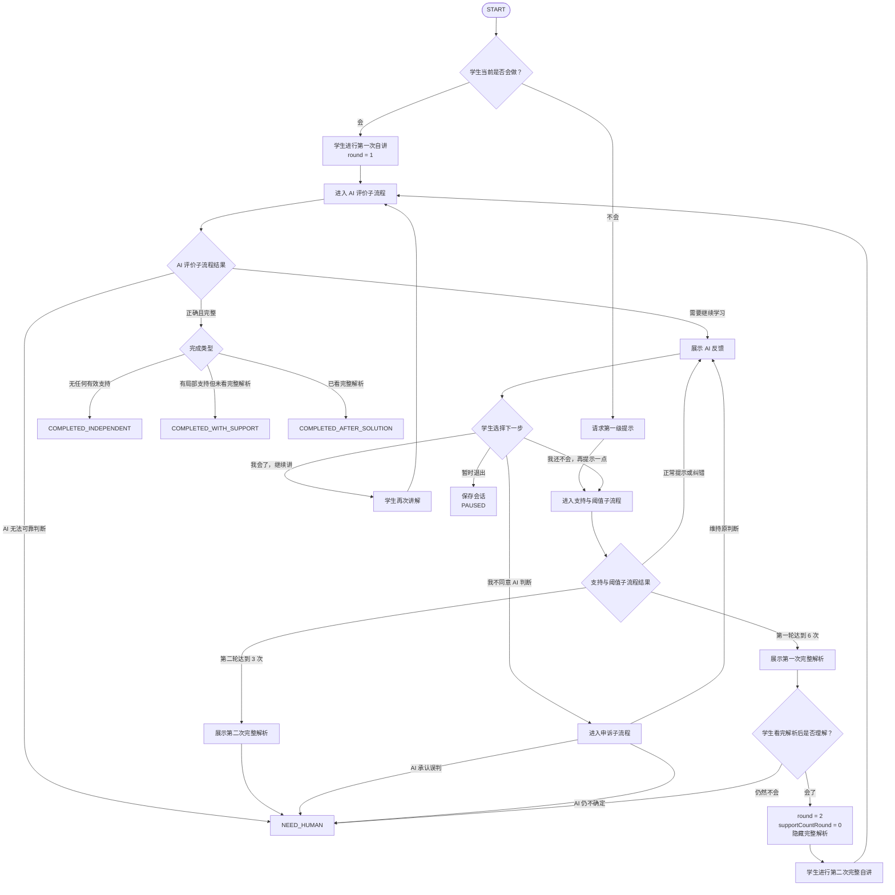
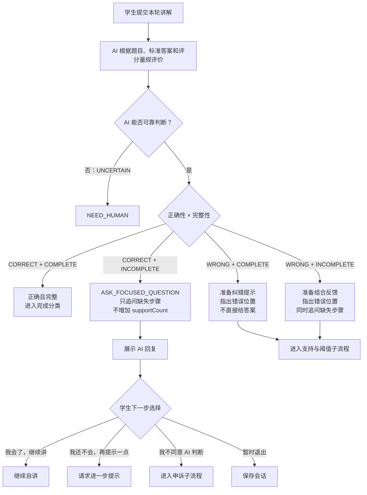
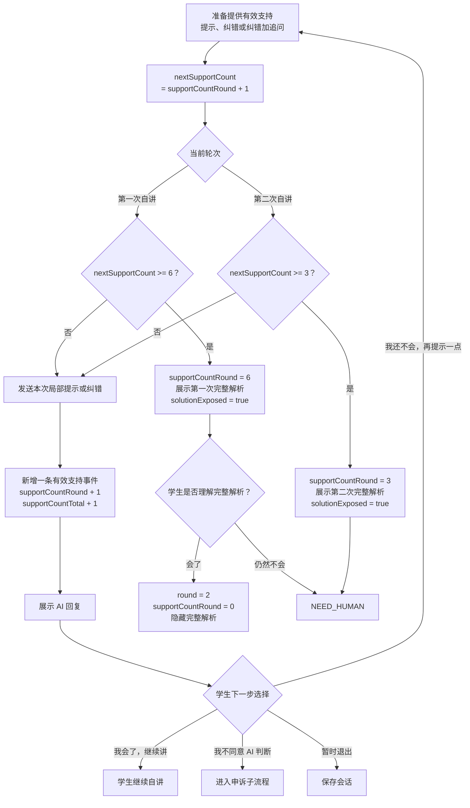
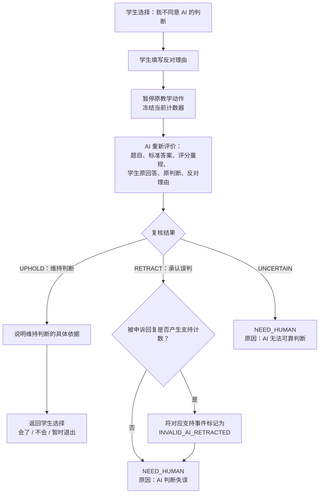

# AI 自讲 Demo 流程设计

## 1. 文档目的

本文档用于描述 AI 自讲 Demo 的业务流程、AI 评价规则、提示与纠错阈值、学生申诉机制、状态转换和计数方式。

Demo 的主要目标是验证以下闭环能否稳定运行：

1. 学生选择“会”或“不会”。
2. 学生自讲，或根据分层提示继续思考。
3. AI 从“正确性”和“完整性”两个维度评价学生表达。
4. 学生获得 AI 回复后，可以继续选择“我会了”“我还不会”或“我不同意 AI 判断”。
5. 系统根据当前轮次和有效支持次数决定继续提示、展示完整解析或转人工处理。
6. 系统区分独立完成、提示后完成、查看完整解析后完成和需要人工介入。

## 2. 核心约定

### 2.1 学生操作

AI 每次给出非终态回复后，学生可以选择：

- **我会了，继续讲**：表示学生准备再次讲解，不代表已经完成。
- **我还不会，再提示一点**：请求下一层提示或纠错。
- **我不同意 AI 的判断**：填写反对理由并进入申诉复核。
- **暂时退出**：保存会话，后续恢复。

### 2.2 AI 评价维度

AI 不直接决定整个业务状态，只返回评价结果。评价拆成两个独立维度：

- 正确性：`CORRECT`、`WRONG`、`UNCERTAIN`。
- 完整性：`COMPLETE`、`INCOMPLETE`。

### 2.3 自讲轮次

- `round = 1`：第一次自讲，有效支持次数达到 6 时展示完整解析。
- `round = 2`：看过第一次完整解析后的第二次自讲，有效支持次数达到 3 时再次展示完整解析，并进入 `NEED_HUMAN`。

---

## 3. 主流程图

主流程描述一次完整 AI 自讲会话的生命周期。学生最初选择“会”时直接开始自讲，选择“不会”时请求第一级提示。AI 每次评价后，如果学生尚未完成，就重新提供“会了、不会、不同意”三个选择。第一次达到支持阈值后，系统展示完整解析并要求第二次自讲；第二次达到阈值或 AI 无法可靠判断时进入人工介入。

### 3.1 流程图



### 3.2 Mermaid 源码

<details>
<summary>点击展开主流程图 Mermaid 源码</summary>

```text
flowchart TD
    START(["START"]) --> INIT_CHOICE{"学生当前是否会做？"}

    INIT_CHOICE -- "会" --> EXPLAIN["学生进行第一次自讲<br/>round = 1"]
    INIT_CHOICE -- "不会" --> REQUEST_HINT["请求第一级提示"]

    EXPLAIN --> AI_FLOW["进入 AI 评价子流程"]
    REQUEST_HINT --> SUPPORT_FLOW["进入支持与阈值子流程"]

    AI_FLOW --> AI_RESULT{"AI 评价子流程结果"}

    AI_RESULT -- "正确且完整" --> COMPLETE_TYPE{"完成类型"}
    COMPLETE_TYPE -- "无任何有效支持" --> COMPLETE_INDEPENDENT["COMPLETED_INDEPENDENT"]
    COMPLETE_TYPE -- "有局部支持但未看完整解析" --> COMPLETE_SUPPORT["COMPLETED_WITH_SUPPORT"]
    COMPLETE_TYPE -- "已看完整解析" --> COMPLETE_SOLUTION["COMPLETED_AFTER_SOLUTION"]

    AI_RESULT -- "AI 无法可靠判断" --> NEED_HUMAN["NEED_HUMAN"]
    AI_RESULT -- "需要继续学习" --> MODEL_REPLY["展示 AI 反馈"]

    SUPPORT_FLOW --> SUPPORT_RESULT{"支持与阈值子流程结果"}
    SUPPORT_RESULT -- "正常提示或纠错" --> MODEL_REPLY
    SUPPORT_RESULT -- "第一轮达到 6 次" --> FULL_SOLUTION_1["展示第一次完整解析"]
    SUPPORT_RESULT -- "第二轮达到 3 次" --> FULL_SOLUTION_2["展示第二次完整解析"]
    FULL_SOLUTION_2 --> NEED_HUMAN

    MODEL_REPLY --> STUDENT_ACTION{"学生选择下一步"}
    STUDENT_ACTION -- "我会了，继续讲" --> EXPLAIN_AGAIN["学生再次讲解"]
    EXPLAIN_AGAIN --> AI_FLOW
    STUDENT_ACTION -- "我还不会，再提示一点" --> SUPPORT_FLOW
    STUDENT_ACTION -- "我不同意 AI 判断" --> DISPUTE_FLOW["进入申诉子流程"]
    STUDENT_ACTION -- "暂时退出" --> PAUSED["保存会话<br/>PAUSED"]

    DISPUTE_FLOW -- "维持原判断" --> MODEL_REPLY
    DISPUTE_FLOW -- "AI 承认误判" --> NEED_HUMAN
    DISPUTE_FLOW -- "AI 仍不确定" --> NEED_HUMAN

    FULL_SOLUTION_1 --> UNDERSTAND{"学生看完解析后是否理解？"}
    UNDERSTAND -- "会了" --> ROUND_2["round = 2<br/>supportCountRound = 0<br/>隐藏完整解析"]
    ROUND_2 --> SECOND_EXPLAIN["学生进行第二次完整自讲"]
    SECOND_EXPLAIN --> AI_FLOW
    UNDERSTAND -- "仍然不会" --> NEED_HUMAN
```

</details>

---

## 4. AI 评价子图

AI 评价子流程只负责判断学生当前表达的正确性和完整性，不直接控制支持阈值。`CORRECT + COMPLETE` 可以完成；`CORRECT + INCOMPLETE` 只进行聚焦追问；出现错误时需要准备纠错反馈，并交给支持与阈值子流程决定是发送局部帮助还是直接展示完整解析。`UNCERTAIN` 不继续自动教学，直接进入人工介入。

### 4.1 流程图



### 4.2 Mermaid 源码

<details>
<summary>点击展开 AI 评价子图 Mermaid 源码</summary>

```text
flowchart TD
    INPUT["学生提交本轮讲解"] --> AI_EVAL["AI 根据题目、标准答案和评分量规评价"]

    AI_EVAL --> CERTAIN{"AI 能否可靠判断？"}
    CERTAIN -- "否：UNCERTAIN" --> NEED_HUMAN["NEED_HUMAN"]
    CERTAIN -- "是" --> JUDGE{"正确性 × 完整性"}

    JUDGE -- "CORRECT + COMPLETE" --> PASS["正确且完整<br/>进入完成分类"]

    JUDGE -- "CORRECT + INCOMPLETE" --> FOLLOW_UP["ASK_FOCUSED_QUESTION<br/>只追问缺失步骤<br/>不增加 supportCount"]

    JUDGE -- "WRONG + COMPLETE" --> CORRECTION["准备纠错提示<br/>指出错误位置<br/>不直接给答案"]

    JUDGE -- "WRONG + INCOMPLETE" --> COMBINED["准备组合反馈<br/>指出错误位置<br/>同时追问缺失步骤"]

    FOLLOW_UP --> REPLY["展示 AI 回复"]
    CORRECTION --> SUPPORT_CHECK["进入支持与阈值子流程"]
    COMBINED --> SUPPORT_CHECK

    REPLY --> STUDENT_ACTION{"学生下一步选择"}
    STUDENT_ACTION -- "我会了，继续讲" --> NEXT_EXPLAIN["继续自讲"]
    STUDENT_ACTION -- "我还不会，再提示一点" --> NEXT_HINT["请求进一步提示"]
    STUDENT_ACTION -- "我不同意 AI 判断" --> DISPUTE["进入申诉子流程"]
    STUDENT_ACTION -- "暂时退出" --> PAUSED["保存会话"]
```

</details>

---

## 5. 支持与阈值子图

支持与阈值子流程统一处理提示、纠错和“纠错加追问”。每次准备提供有效帮助时，系统先计算 `nextSupportCount`，再判断是否达到当前轮次阈值。第一次自讲达到 6 次时不再发送第 6 次局部提示，而是直接展示完整解析；第二次自讲达到 3 次时直接展示完整解析并等待人工介入。

学生收到普通提示或纠错后，仍然可以选择“我会了”“我还不会”或“我不同意”。第一次看完完整解析后也可以选择是否理解：理解则进入第二次自讲，不理解则直接转人工。

### 5.1 流程图



### 5.2 Mermaid 源码

<details>
<summary>点击展开支持与阈值子图 Mermaid 源码</summary>

```text
flowchart TD
    SUPPORT_REQUEST["准备提供有效支持<br/>提示、纠错或纠错加追问"] --> NEXT_COUNT["nextSupportCount<br/>= supportCountRound + 1"]

    NEXT_COUNT --> ROUND{"当前轮次"}

    ROUND -- "第一次自讲" --> FIRST_LIMIT{"nextSupportCount >= 6？"}
    ROUND -- "第二次自讲" --> SECOND_LIMIT{"nextSupportCount >= 3？"}

    FIRST_LIMIT -- "否" --> DELIVER["发送本次局部提示或纠错"]
    SECOND_LIMIT -- "否" --> DELIVER

    DELIVER --> COUNT["新增一条有效支持事件<br/>supportCountRound + 1<br/>supportCountTotal + 1"]
    COUNT --> MODEL_REPLY["展示 AI 回复"]

    MODEL_REPLY --> STUDENT_ACTION{"学生下一步选择"}
    STUDENT_ACTION -- "我会了，继续讲" --> SELF_EXPLAIN["学生继续自讲"]
    STUDENT_ACTION -- "我还不会，再提示一点" --> SUPPORT_REQUEST
    STUDENT_ACTION -- "我不同意 AI 判断" --> DISPUTE["进入申诉子流程"]
    STUDENT_ACTION -- "暂时退出" --> PAUSED["保存会话"]

    FIRST_LIMIT -- "是" --> FIRST_FULL["supportCountRound = 6<br/>展示第一次完整解析<br/>solutionExposed = true"]
    FIRST_FULL --> UNDERSTAND{"学生是否理解完整解析？"}
    UNDERSTAND -- "会了" --> ROUND_TWO["round = 2<br/>supportCountRound = 0<br/>隐藏完整解析"]
    UNDERSTAND -- "仍然不会" --> NEED_HUMAN["NEED_HUMAN"]

    SECOND_LIMIT -- "是" --> SECOND_FULL["supportCountRound = 3<br/>展示第二次完整解析<br/>solutionExposed = true"]
    SECOND_FULL --> NEED_HUMAN
```

</details>

---

## 6. 申诉子图

学生可以对每次 AI 判断提出反对，但必须填写具体理由。进入申诉后，系统暂停原教学动作，不新增支持次数。AI 使用题目、标准答案、评分量规、学生原回答、原判断和反对理由重新评价。AI 维持原判断时需要说明具体依据；AI 承认误判或仍然无法确定时，直接进入人工介入。

如果被申诉的 AI 回复已经产生支持计数，而 AI 在复核时承认误判，则该支持事件应标记为无效，不再计入有效支持次数，但保留记录用于审计。

### 6.1 流程图



### 6.2 Mermaid 源码

<details>
<summary>点击展开申诉子图 Mermaid 源码</summary>

```text
flowchart TD
    DISPUTE_START["学生选择：我不同意 AI 的判断"] --> REQUIRE_REASON["学生填写反对理由"]

    REQUIRE_REASON --> FREEZE["暂停原教学动作<br/>冻结当前计数器"]
    FREEZE --> REVIEW["AI 重新评价：<br/>题目、标准答案、评分量规、<br/>学生原回答、原判断、反对理由"]

    REVIEW --> REVIEW_RESULT{"复核结果"}

    REVIEW_RESULT -- "UPHOLD：维持判断" --> EVIDENCE["说明维持判断的具体依据"]
    EVIDENCE --> RETURN_CHOICE["返回学生选择<br/>会了 / 不会 / 暂时退出"]

    REVIEW_RESULT -- "RETRACT：承认误判" --> HAS_SUPPORT{"被申诉回复是否产生支持计数？"}
    HAS_SUPPORT -- "是" --> INVALID_SUPPORT["将对应支持事件标记为<br/>INVALID_AI_RETRACTED"]
    HAS_SUPPORT -- "否" --> NEED_HUMAN_1["NEED_HUMAN<br/>原因：AI 判断失误"]
    INVALID_SUPPORT --> NEED_HUMAN_1

    REVIEW_RESULT -- "UNCERTAIN" --> NEED_HUMAN_2["NEED_HUMAN<br/>原因：AI 无法可靠判断"]
```

</details>

---

## 7. 状态转换表

### 7.1 会话状态

| 状态 | 含义 | 允许的下一状态 |
|---|---|---|
| `START` | 会话刚创建 | `WAIT_CHOICE` |
| `WAIT_CHOICE` | 等待学生选择会或不会 | `ROUND_1_EXPLANATION`、`ROUND_1_GUIDED` |
| `ROUND_1_EXPLANATION` | 第一次自讲 | `AI_EVALUATING`、`PAUSED` |
| `ROUND_1_GUIDED` | 第一次自讲的提示阶段 | `ROUND_1_EXPLANATION`、`FULL_SOLUTION`、`DISPUTE_REVIEW`、`PAUSED` |
| `ROUND_2_EXPLANATION` | 看过完整解析后的第二次自讲 | `AI_EVALUATING`、`FULL_SOLUTION`、`DISPUTE_REVIEW`、`PAUSED` |
| `AI_EVALUATING` | AI 正在评价学生表达 | 完成状态、当前轮次状态、`NEED_HUMAN` |
| `WAIT_STUDENT_ACTION` | 已展示 AI 回复，等待学生下一步选择 | 当前轮自讲、支持流程、`DISPUTE_REVIEW`、`PAUSED` |
| `DISPUTE_REVIEW` | AI 正在复核学生申诉 | `WAIT_STUDENT_ACTION`、`NEED_HUMAN` |
| `FULL_SOLUTION` | 正在展示完整解析 | `ROUND_2_EXPLANATION`、`NEED_HUMAN` |
| `PAUSED` | 学生暂时退出，会话可恢复 | 暂停前状态、`ABORTED` |
| `COMPLETED_INDEPENDENT` | 未获得有效支持，独立完成 | 终态 |
| `COMPLETED_WITH_SUPPORT` | 获得局部支持后完成 | 终态 |
| `COMPLETED_AFTER_SOLUTION` | 看过完整解析后完成 | 终态 |
| `NEED_HUMAN` | 需要人工介入 | 人工判定完成、恢复指定轮次、关闭会话 |
| `ABORTED` | 会话被主动关闭 | 终态 |

### 7.2 教学判断转换表

| 当前轮次 | AI 正确性 | 完整性 | 系统动作 | 支持计数 | 下一状态 |
|---|---|---|---|---|---|
| 第一轮或第二轮 | `CORRECT` | `COMPLETE` | 根据帮助情况分类完成 | 不增加 | 对应 `COMPLETED_*` |
| 第一轮或第二轮 | `CORRECT` | `INCOMPLETE` | 聚焦追问缺失步骤 | 不增加 | `WAIT_STUDENT_ACTION` |
| 第一轮或第二轮 | `WRONG` | `COMPLETE` | 准备指出错误位置 | 阈值检查后决定 | 当前轮次或 `FULL_SOLUTION` |
| 第一轮或第二轮 | `WRONG` | `INCOMPLETE` | 准备指出错误并追问缺失步骤 | 阈值检查后只增加 1 次 | 当前轮次或 `FULL_SOLUTION` |
| 任意轮次 | `UNCERTAIN` | 任意 | 停止自动评价 | 不增加 | `NEED_HUMAN` |
| 第一轮 | 即将达到 6 次支持 | 任意 | 不发送第 6 次局部提示，直接展示完整解析 | 当前轮记为 6 | `FULL_SOLUTION` |
| 第二轮 | 即将达到 3 次支持 | 任意 | 不发送第 3 次局部提示，直接展示完整解析 | 当前轮记为 3 | `NEED_HUMAN` |

### 7.3 学生操作转换表

| 学生操作 | 前置条件 | 系统行为 | 下一状态 |
|---|---|---|---|
| 我会了，继续讲 | 已展示非终态 AI 回复 | 打开讲解输入区域，不直接判定完成 | 当前轮自讲状态 |
| 我还不会，再提示一点 | 已展示非终态 AI 回复 | 请求下一层有效支持并检查阈值 | 支持与阈值流程 |
| 我不同意 AI 判断 | 已展示 AI 判断 | 要求填写理由，暂停原动作 | `DISPUTE_REVIEW` |
| 暂时退出 | 非终态会话 | 保存上下文和恢复状态 | `PAUSED` |
| 看懂第一次完整解析 | 第一轮展示完整解析后 | 隐藏解析、重置当前轮计数 | `ROUND_2_EXPLANATION` |
| 未看懂第一次完整解析 | 第一轮展示完整解析后 | 停止自动教学 | `NEED_HUMAN` |

### 7.4 申诉转换表

| 复核结果 | 系统行为 | 支持计数处理 | 下一状态 |
|---|---|---|---|
| `UPHOLD` | AI 说明维持判断的量规依据 | 不重复增加 | `WAIT_STUDENT_ACTION` |
| `RETRACT` | 保存 AI 误判信息 | 已计数的对应支持事件标记无效 | `NEED_HUMAN` |
| `UNCERTAIN` | 保存无法判断的原因 | 不增加 | `NEED_HUMAN` |

---

## 8. 计数规则

### 8.1 计数器定义

| 字段 | 含义 | 重置时机 |
|---|---|---|
| `round` | 当前自讲轮次，取值为 1 或 2 | 会话开始时设为 1；进入第二次自讲时设为 2 |
| `supportCountRound` | 当前轮有效支持次数 | 进入第二次自讲时清零 |
| `supportCountTotal` | 整个会话有效支持总次数 | 不重置 |
| `hintCount` | 有效提示次数 | 不重置 |
| `correctionCount` | 有效纠错次数 | 不重置 |
| `focusedQuestionCount` | 聚焦追问次数 | 不重置，但不计入支持次数 |
| `noProgressCount` | 连续未新增关键步骤的次数 | 学生覆盖新的评分点时清零 |
| `disputeCount` | 学生正式申诉次数 | 不重置 |
| `solutionExposed` | 是否展示过完整解析 | 展示第一次完整解析后设为 `true` |

### 8.2 哪些动作计入支持次数

以下动作计入一次有效支持：

- `GIVE_HINT`
- `GIVE_CORRECTION`
- `CORRECT_AND_ASK`

其中 `CORRECT_AND_ASK` 虽然同时包含纠错和追问，但只计一次有效支持。

以下情况不计入支持次数：

- `ASK_FOCUSED_QUESTION`
- 学生申诉
- AI 维持原判断时说明依据
- 空输入被前端拦截
- 网络错误、模型超时和服务异常
- 被 AI 复核为误判并标记无效的支持事件

### 8.3 阈值判断伪代码

```text
当系统准备执行 GIVE_HINT、GIVE_CORRECTION 或 CORRECT_AND_ASK 时：

nextSupportCount = supportCountRound + 1

如果 round == 1 且 nextSupportCount >= 6：
    supportCountRound = 6
    solutionExposed = true
    展示完整答案解析
    等待学生选择是否理解

    如果学生选择“会了”：
        round = 2
        supportCountRound = 0
        隐藏完整解析
        要求学生进行第二次完整自讲

    如果学生选择“仍然不会”：
        进入 NEED_HUMAN

否则如果 round == 2 且 nextSupportCount >= 3：
    supportCountRound = 3
    solutionExposed = true
    展示完整答案解析
    进入 NEED_HUMAN

否则：
    创建一条 VALID 支持事件
    supportCountRound += 1
    supportCountTotal += 1
    发送本次局部提示或纠错
    等待学生重新选择“会了 / 不会 / 不同意”
```

### 8.4 聚焦追问无进展规则

`ASK_FOCUSED_QUESTION` 不增加支持次数，因此需要避免无限追问：

```text
如果学生本轮覆盖了新的评分点：
    noProgressCount = 0

否则：
    noProgressCount += 1

如果 noProgressCount >= 2：
    下一次聚焦追问升级为 GIVE_HINT
    GIVE_HINT 进入正常阈值检查并计入支持次数
```

### 8.5 支持事件有效性

建议每次支持都保存独立事件，而不是只修改数字：

```text
supportEvent.status：
    VALID
    INVALID_AI_RETRACTED
```

有效支持次数应按 `VALID` 事件计算。AI 在申诉复核中承认误判时，将对应支持事件标记为 `INVALID_AI_RETRACTED`，保留审计记录但不再计入阈值。

### 8.6 完成类型判定

```text
如果 supportCountTotal == 0 且 solutionExposed == false：
    COMPLETED_INDEPENDENT

如果 supportCountTotal > 0 且 solutionExposed == false：
    COMPLETED_WITH_SUPPORT

如果 solutionExposed == true 且第二次自讲正确完整：
    COMPLETED_AFTER_SOLUTION
```

---

## 9. 示例对话

### 9.1 示例一：第一次独立完成

**场景**：学生选择“会”，第一次自讲已经正确且完整。

> **系统**：你觉得这道题会做吗？
>
> **学生**：会。
>
> **系统**：请完整讲出你的解题思路，不要只说最终答案。
>
> **学生**：先根据题目条件建立一元二次方程，然后求出两个根。因为题目中的数量必须为正数，所以舍去负根，最终答案是 4。
>
> **AI评价**：你的讲解正确且完整。你说明了建模方法、求解步骤以及舍去负根的原因。

结果：

```text
correctness = CORRECT
completeness = COMPLETE
supportCountTotal = 0
solutionExposed = false
status = COMPLETED_INDEPENDENT
```

### 9.2 示例二：回答错误且步骤不完整，纠错后继续自讲

**场景**：学生存在错误，同时缺少关键步骤。AI既要指出错误位置，也要追问缺失步骤。

> **学生**：因为 A 能推出 B，所以 A 和 B 是等价条件，答案选 A。
>
> **AI**：你正确识别了需要比较两个条件，但“A 能推出 B”只能说明 A 是 B 的充分条件，不能直接说明二者等价。还需要验证哪个反向关系？
>
> **系统提供选择**：
> - 我会了，继续讲
> - 我还不会，再提示一点
> - 我不同意 AI 的判断
>
> **学生**：我会了，继续讲。
>
> **学生**：还需要验证 B 能否推出 A。如果两个方向都成立，才能说明 A 和 B 等价。
>
> **AI评价**：正确且完整。

结果：

```text
第一次 AI 评价：WRONG + INCOMPLETE
动作：CORRECT_AND_ASK
supportCountRound = 1
第二次 AI 评价：CORRECT + COMPLETE
status = COMPLETED_WITH_SUPPORT
```

### 9.3 示例三：学生收到回复后仍选择不会

**场景**：AI已经指出部分方向，但学生仍不理解，因此主动请求下一层提示。

> **AI**：这道题需要先找到两个量之间的等量关系。你能指出题目中哪一句描述了总量吗？
>
> **系统提供选择**：
> - 我会了，继续讲
> - 我还不会，再提示一点
> - 我不同意 AI 的判断
>
> **学生**：我还不会，再提示一点。
>
> **AI**：可以把“原有数量”和“增加的数量”相加，得到题目给出的总数量。先尝试把这三个量写成一个等式。
>
> **系统再次提供选择**：
> - 我会了，继续讲
> - 我还不会，再提示一点
> - 我不同意 AI 的判断
>
> **学生**：我会了，继续讲。
>
> **学生**：设原有数量为 x，增加了 3，总量是 10，所以可以列出 x + 3 = 10，再求出 x = 7。

结果：

```text
学生每次获得 AI 回复后都可以重新选择会或不会。
选择“不会”触发下一次支持和阈值检查。
选择“会”只会进入新的自讲，不会直接完成。
```

### 9.4 示例四：第一次达到 6 次支持后进入第二次自讲

**场景**：第一次自讲中即将产生第 6 次有效支持。

> **系统内部状态**：`round = 1`，`supportCountRound = 5`。
>
> **学生**：我还是不会，再提示一点。
>
> **系统**：检测到 `nextSupportCount = 6`，不再发送第 6 次局部提示，直接展示完整解析。
>
> **AI完整解析**：先设未知数，根据题意建立方程……最后检验结果是否符合题目条件。
>
> **系统**：你是否已经理解完整解析？
>
> **学生**：会了。
>
> **系统**：现在隐藏解析，请从头进行第二次完整自讲。

结果：

```text
round = 2
supportCountRound = 0
supportCountTotal 保留第一轮累计值
solutionExposed = true
```

### 9.5 示例五：第二次达到 3 次支持后人工介入

**场景**：学生看过完整解析，但第二次自讲中仍需要多次帮助。

> **系统内部状态**：`round = 2`，`supportCountRound = 2`。
>
> **学生**：我还不会，再提示一点。
>
> **系统**：检测到 `nextSupportCount = 3`，直接展示完整解析。
>
> **系统**：本次自讲需要老师进一步帮助，已保存你的自讲过程和困难位置。

结果：

```text
supportCountRound = 3
status = NEED_HUMAN
needHumanReason = ROUND_2_SUPPORT_LIMIT
```

### 9.6 示例六：学生申诉，AI维持原判断

> **AI**：你把充分条件判断成了充要条件，这一步不正确。
>
> **学生**：我不同意。因为题目中 A 和 B 看起来表达的是同一个范围。
>
> **AI复核**：我维持原判断。你目前只说明了 A 可以推出 B，但没有证明 B 可以推出 A。评分量规要求两个方向都成立才能判断为充要条件。
>
> **系统提供选择**：
> - 我会了，继续讲
> - 我还不会，再提示一点
> - 暂时退出

结果：

```text
disputeResult = UPHOLD
supportCount 不重复增加
流程返回 WAIT_STUDENT_ACTION
```

### 9.7 示例七：学生申诉，AI承认误判

> **AI**：你的变形步骤不成立，因为这里不能同时除以 x。
>
> **学生**：我不同意。我前面已经根据题目条件证明了 x 不等于 0，所以这里可以同时除以 x。
>
> **AI复核**：你说得对。原讲解中已经给出了 x 不等于 0 的依据，我之前忽略了这个条件，原判断有误。
>
> **系统**：AI判断存在争议，已保存当前过程并等待人工确认。

结果：

```text
disputeResult = RETRACT
相关支持事件 = INVALID_AI_RETRACTED
status = NEED_HUMAN
needHumanReason = AI_RETRACTED
```

### 9.8 示例八：AI无法可靠判断

> **学生**：我使用了另一种辅助线，通过两个三角形面积相等得到这个比例。
>
> **AI**：当前题目上下文不足以验证这条辅助线是否满足条件，我无法可靠判断该证明是否成立。
>
> **系统**：已保存你的解法，等待老师确认。

结果：

```text
correctness = UNCERTAIN
status = NEED_HUMAN
needHumanReason = AI_UNCERTAIN
```

---

## 10. Demo 阶段需要验证的指标

- 正确讲解被误判为错误的比例。
- 错误讲解被误判为完成的比例。
- `UNCERTAIN` 触发率。
- 学生申诉率、AI维持率和AI撤回率。
- 第一次自讲平均有效支持次数。
- 第二次自讲触发率和完成率。
- 完整解析展示率。
- 人工介入率及介入原因分布。
- 学生连续选择“不会”的次数分布。
- 聚焦追问连续无进展的比例。

## 11. 合理性批判与不足分析

1. **每次允许重新选择“会/不会”更符合真实学习过程，但可能被用来快速套取答案。** Demo需要记录连续点击“不会”的行为，后续再决定是否要求学生在获得提示后至少尝试一次。
2. **6次和3次阈值便于验证流程，但属于经验值。** 不同学科、题型和难度可能需要不同阈值，正式接入时应配置化，并依据Demo数据调整。
3. **申诉机制可以降低AI权威化风险，但会提高人工介入率。** 如果 `AI_RETRACTED` 或 `AI_UNCERTAIN` 占比过高，应优先调整评分量规和评价Prompt，而不是直接扩大人工团队。
4. **多个流程图提高了可读性，也增加了同步维护成本。** 状态转换表和计数规则应作为实现与测试的权威来源，Mermaid图只作为可视化说明。
5. **Demo如果只使用文本输入，无法完全验证真实口语自讲。** 文本流程稳定后，还需要单独验证语音识别、数学公式转写、停顿和口语指代对AI判断的影响。
