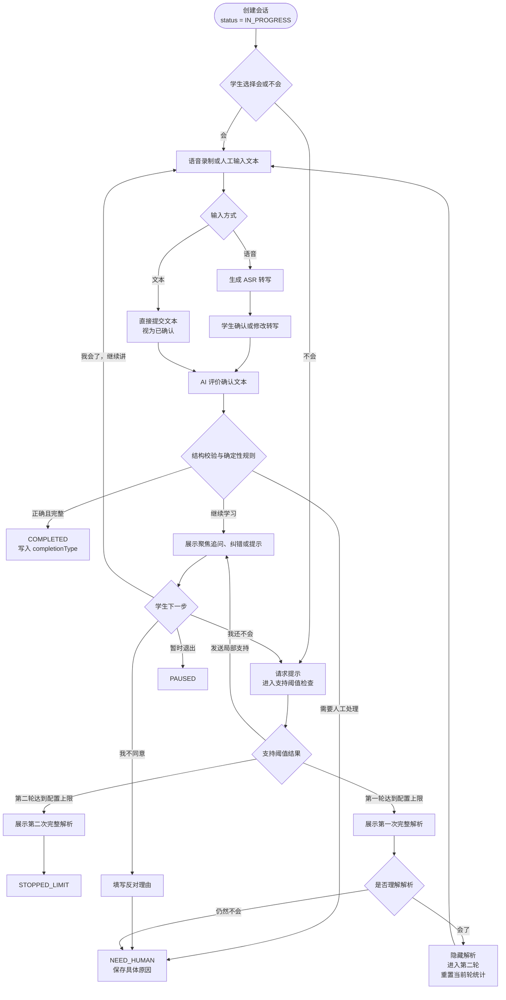

# AI 自讲 Demo：需求与范围

## 1. 文档目的

本文档记录 AI 自讲 Demo 当前已经确认的需求边界，作为后续流程设计、实现和验收的需求基线。

本阶段只验证学生提交确认文本之后，AI 能否正确评价并引导学生完成自讲。系统仍需实现语音录制、ASR 转写和转写确认，但 AI 的评价对象是学生最终确认的文本，ASR 结果本身不作为学生是否讲对的依据。

## 2. 项目目标

Demo 的唯一核心目标是验证 AI 能否：

1. 获取学生确认后的自讲文本。
2. 从正确性和完整性两个维度评价学生表达。
3. 找出学生已经覆盖和仍然缺失的关键评分点。
4. 引用学生原话，指出具体错误、缺失及下一步思考方向。
5. 通过有限次数的聚焦追问、纠错和分层提示，引导学生重新讲清楚。
6. 在无法可靠判断、学生申诉或发现其他需要人工处理的问题时，停止自动流程并进入 `NEED_HUMAN`。

## 3. 目标用户

### 3.1 学生

- 开始时选择“会”或“不会”。
- 通过语音或人工输入文本提交自讲内容。
- 使用语音时确认或修改 ASR 转写文本。
- 查看 AI 反馈后继续自讲、请求提示、提出申诉或暂时退出。

### 3.2 录题人员

由人工录入题目及评价所需材料。本阶段不限定录题人员所属角色，也不实现人员管理功能。

### 3.3 人工处理人员

系统进入 `NEED_HUMAN` 时，只保存并报告具体原因。本阶段不实现离线复核、派单、处理或复核后状态更新功能。

## 4. 核心使用场景

1. 人工录入题目和评分材料。
2. 学生选择“会”或“不会”。
3. 选择“会”后，学生直接开始自讲；选择“不会”后，大模型结合人工录入的分层提示上下文生成本次提示，系统按确定性规则进行支持计数和阈值检查。
4. 学生可以录制语音，由系统生成 ASR 转写；也可以直接人工输入文本。
5. 语音输入必须由学生确认或修改转写。人工输入文本视为已经确认。
6. AI 只评价学生最终确认的文本。
7. AI 返回结构化评价和面向学生的反馈。
8. 学生继续自讲或请求进一步提示，系统按确定性计数规则推进流程。
9. 第一轮达到 6 次有效支持时展示完整解析；学生确认理解后，系统隐藏解析并要求第二轮完整自讲。
10. 第二轮达到 3 次有效支持时再次展示完整解析，并以 `STOPPED_LIMIT` 结束。
11. AI 无法可靠判断、学生提出申诉，或 AI 认为存在其他必须人工处理的问题时，以 `NEED_HUMAN` 结束自动流程。

## 5. 输入

### 5.1 题目数据

每道题至少包含：

- 题目内容。
- 标准答案。
- 必须讲出的关键评分点。
- 常见错误。
- 可接受的其他解法。
- 分层提示。
- 完整解析。

关键评分点是判断完整性的主要依据。题目及评分材料均由人工录入，不自动生成。

### 5.2 学生数据

- 初始选择：“会”或“不会”。
- 原始音频，仅在语音输入时产生。
- ASR 原始转写文本，仅在语音输入时产生。
- 学生确认或修改后的文本。
- 学生直接人工输入的文本。
- 学生后续操作：“我会了，继续讲”“我还不会，再提示一点”“我不同意 AI 判断”“暂时退出”。
- 学生提出申诉时填写的反对理由。

系统不要求 ASR 置信度，也不要求学生或人工额外标记转写质量。

## 6. 输出

### 6.1 AI 结构化评价

每次评价至少返回：

| 字段 | 取值或含义 |
|---|---|
| `correctness` | `CORRECT`、`WRONG`、`UNCERTAIN` |
| `completeness` | `COMPLETE`、`INCOMPLETE` |
| `coveredPoints` | 已覆盖的关键评分点 |
| `missingPoints` | 未覆盖的关键评分点 |
| `errorEvidence` | 学生确认文本中的错误原话及说明 |
| `feedback` | 面向学生的简短反馈 |
| `confidence` | Demo 阶段固定为 `1` |
| `nextAction` | AI 建议的下一教学动作 |
| `needHumanReason` | 进入 `NEED_HUMAN` 时的具体原因；其他情况为空 |

`needHumanReason` 使用大模型生成的具体原因文本，不再拆分为转写质量、判断矛盾等独立标签。

### 6.1.1 学生可见评价与反馈时间线

- 学生提交确认文本后，只展示中文化的正确性和完整性结果：`正确`、`有错误`、`暂无法可靠判断`、`完整`、`不完整`。
- 学生端不展示 `CORRECT`、`INCOMPLETE`、`nextAction`、覆盖/缺失评分点、原始 JSON、结构校验错误或模型原始响应。
- 按实际发送顺序展示本会话全部学生可见 AI 反馈、聚焦追问、纠错、有效支持、完整解析展示事件和人工处理说明；刷新页面后仍可读取。
- 结构校验失败、模型重试和其他技术错误只保存审计记录，不进入学生反馈时间线。
- 第一轮完整解析展示后，时间线只保留“已展示完整解析”事件；进入第二轮后不得从时间线重新展开完整答案。

### 6.2 会话结果

会话业务状态只有：

| 状态 | 含义 |
|---|---|
| `IN_PROGRESS` | 自动自讲流程正在进行 |
| `COMPLETED` | 当前轮自讲被判定为正确且完整 |
| `STOPPED_LIMIT` | 第二轮达到 3 次有效支持，展示完整解析后结束 |
| `NEED_HUMAN` | 自动流程停止，只报告需要人工处理的具体原因 |
| `PAUSED` | 学生暂时退出，可以恢复 |

`AI_UNCERTAIN` 不作为单独业务状态。AI 无法可靠判断时统一进入 `NEED_HUMAN`。

`COMPLETED` 是唯一的学习成功终态。`NEED_HUMAN` 和 `STOPPED_LIMIT` 保留为非成功终态，用于停止无法可靠继续或达到自动支持上限的流程。

完成方式不拆分为业务状态，而是保存为 `completionType` 统计标签：

- `INDEPENDENT`：未获得有效支持且未查看完整解析时完成。
- `WITH_SUPPORT`：获得局部支持但未查看完整解析时完成。
- `AFTER_SOLUTION`：查看完整解析并在第二轮重新自讲后完成。

### 6.3 过程记录

每轮至少保存：

- 原始音频，如有。
- ASR 原始转写文本，如有。
- 学生最终确认或直接输入的文本。
- AI 结构化评价。
- AI 面向学生的反馈。
- 学生下一轮回答和操作。
- 支持事件与有效性。
- 当前轮次、计数器和最终状态。
- 每一步耗时。
- 申诉理由或 `needHumanReason`，如有。

## 7. 必须实现的功能

1. 人工录入题目和评分材料。
2. “会”或“不会”的初始选择。
3. 语音录制、ASR 转写、转写展示、学生确认和修改。
4. 人工直接输入自讲文本。
5. 对确认文本进行正确性和完整性评价。
6. 识别已覆盖和缺失的关键评分点。
7. 引用学生原话说明错误位置、错误原因和下一步思考方向。
8. 生成聚焦追问、纠错、组合反馈和分层提示。
9. 记录有效支持次数和连续无进展次数。
10. 第一轮 6 次、第二轮 3 次阈值控制。
11. 第一轮展示解析后隐藏解析，并要求第二轮完整自讲。
12. 第二轮达到上限后展示解析并以 `STOPPED_LIMIT` 结束。
13. 学生申诉后直接进入 `NEED_HUMAN`，不再进行 AI 申诉复核。
14. AI 无法可靠判断或认为必须人工处理时进入 `NEED_HUMAN`，并输出具体原因。
15. 暂停与恢复会话。
16. 保存完整测试过程和统计所需数据。

## 8. 暂不实现的功能

- AI 对学生申诉进行二次复核。
- 离线人工复核界面、派单、处理流程及复核后状态更新。
- 门店人工派单和伴学师实时接管。
- 学生分层与动态学习规划。
- 跨学科学习任务。
- 自动生成题目、评分点或评分量规。
- 变式题和隔天掌握检测。
- 家长报告和门店经营数据。
- 大规模并发与成本优化。
- 目标用户学段、学科、能力层次和人员职责管理。
- ASR 置信度、人工转写质量标签和固定的低质量转写判定规则。
- 未成年人数据授权、脱敏、保留期限和删除规则。

## 9. 业务规则与约束

1. AI 只负责评价、生成教学建议和说明进入人工处理的原因。
2. 业务状态转换、计数、阈值和完成方式必须由确定性规则控制，不能由 AI 直接决定。
3. AI 评价对象是学生最终确认的文本。原始音频和 ASR 转写用于过程记录，不作为判定学生对错的直接依据。
4. `confidence` 在 Demo 阶段固定为 `1`，不能用于控制流程。
5. `CORRECT + COMPLETE` 才能进入 `COMPLETED`。
6. `UNCERTAIN` 必须进入 `NEED_HUMAN`。
7. 学生申诉必须填写理由，提交后立即进入 `NEED_HUMAN`，不增加支持次数。
8. AI 可以根据上下文判断文本质量不足、前后判断矛盾或其他无法继续自动评价的情况，但只能输出具体的 `needHumanReason`；系统根据 `nextAction = NEED_HUMAN` 确定性地结束自动流程。
9. AI 指出错误时必须引用学生原话，并说明错误位置、原因和下一步思考方向。
10. 聚焦追问 `ASK_FOCUSED_QUESTION` 不计入有效支持次数。
11. `GIVE_HINT`、`GIVE_CORRECTION` 和 `CORRECT_AND_ASK` 各计一次有效支持。
12. 当前轮连续两次自讲没有覆盖新的关键评分点时，下一次聚焦追问升级为计数的 `GIVE_HINT`；进入第二轮时清零当前轮覆盖记录和连续无进展次数，全会话覆盖记录继续保留用于审计。
13. 第一轮即将产生第 6 次有效支持时，不再发送第 6 次局部支持，直接展示完整解析。
14. 第一轮看完解析后必须隐藏解析并要求学生重新完整自讲，不能直接判定完成。
15. 第二轮即将产生第 3 次有效支持时，不再发送第 3 次局部支持，展示完整解析并以 `STOPPED_LIMIT` 结束。
16. 人工录入的分层提示只作为大模型上下文，具体提示内容由大模型决定，系统不增加提示语义判断。
17. AI 输出结构或字段关系不合法时按配置有限重试；仍不合法则进入 `NEED_HUMAN`，并保存原始响应和校验错误。
18. AI 和 ASR 的超时、重试次数及重试间隔从配置读取；基础设施重试耗尽后保持 `IN_PROGRESS`，退回最近可重试阶段并记录错误。
19. Demo 只允许在等待学生操作的稳定阶段暂停；ASR 转写或 AI 评价处理中提出暂停时，先等待本次调用结束。
20. 学生端展示的状态、正确性、完整性、支持类型和完成结果必须使用中文文案；前端中文文案不得参与业务状态判断。

## 10. 文档权威性

本文档同时包含需求范围、数据契约、业务流程、状态转换和计数规则，是 AI 自讲 Demo 唯一的业务实现依据。

实现和测试发生歧义时，按以下优先级解释：

1. 数据契约、状态转换表和计数伪代码。
2. 明确编号的业务规则。
3. 示例。
4. Mermaid 流程图。

Mermaid 只用于展示，不作为独立规则来源。所有次数、阈值、超时和重试次数均从配置读取；本文件中的第一轮 6 次、第二轮 3 次、连续 2 次无进展，是当前已经确认的业务配置值，不允许散落硬编码在业务逻辑中。

## 11. 核心数据契约

### 11.1 题目

| 字段 | 含义 |
|---|---|
| `questionContent` | 题目内容 |
| `standardAnswer` | 标准答案 |
| `rubricPoints` | 必须讲出的自然语言关键评分点 |
| `commonErrors` | 常见错误 |
| `alternativeSolutions` | 可接受的其他解法 |
| `layeredHints` | 人工录入的分层提示上下文 |
| `fullSolution` | 完整解析 |
| `archivedAt` | 归档时间；为空表示题目可用 |

以上内容均由人工录入，不由系统自动生成。

`rubricPoints` 保持为自然语言列表，不增加稳定 ID 或额外的答案判定逻辑。评分点是否被学生正确覆盖由大模型判断；确定性代码只使用大模型返回的覆盖结果进行集合记录、进展计数和状态转换，不重新判断学生答案语义。

为了使自然语言评分点能够确定性记录，大模型返回 `coveredPoints` 和 `missingPoints` 时，应原样引用本题 `rubricPoints`。系统可以校验返回文本是否来自原列表、两个列表是否重叠以及是否完整覆盖原列表；这些属于输出结构校验，不代表系统对学生答案进行二次判断。

题目归档不删除任何评价材料。题目列表默认只显示未归档题目；录题人员可以查看归档题目并恢复。归档题目仍可被历史记录读取，但不得编辑；后续创建会话时只允许选择未归档题目。

### 11.2 学生自讲输入

| 字段 | 含义 |
|---|---|
| `inputMode` | `VOICE` 或 `TEXT` |
| `audio` | 原始音频；文本输入时为空 |
| `asrTranscript` | ASR 原始转写；文本输入时为空 |
| `confirmedText` | 学生确认、修改或直接输入的最终文本 |
| `confirmedAt` | 文本确认或提交时间 |

`confirmedText` 是 AI 评价的唯一学生表达输入。空文本必须在进入 AI 评价前被拦截并提示学生重新提交。

### 11.3 AI 结构化评价

| 字段 | 约束 |
|---|---|
| `correctness` | `CORRECT`、`WRONG`、`UNCERTAIN` |
| `completeness` | `COMPLETE`、`INCOMPLETE` |
| `coveredPoints` | 本次确认文本覆盖的自然语言评分点列表 |
| `missingPoints` | 本次确认文本缺失的自然语言评分点列表 |
| `errorEvidence` | 学生原话、错误位置、错误原因及下一步思考方向；没有明确错误时为空列表 |
| `feedback` | 面向学生的简短反馈 |
| `confidence` | Demo 阶段固定为数字 `1` |
| `nextAction` | 下一教学动作 |
| `needHumanReason` | `nextAction = NEED_HUMAN` 时必填，其他情况为空 |

`nextAction` 可取：

- `COMPLETE`
- `ASK_FOCUSED_QUESTION`
- `GIVE_CORRECTION`
- `CORRECT_AND_ASK`
- `GIVE_HINT`
- `NEED_HUMAN`

`confidence` 不参与任何业务判断。

### 11.4 AI 输出关系校验

以下情况属于结构或字段关系不合法：

- 缺少必填字段或返回未定义枚举。
- `coveredPoints` 与 `missingPoints` 重叠、遗漏评分点或包含题目中不存在的评分点文本。
- `CORRECT + COMPLETE` 没有配合 `nextAction = COMPLETE`。
- `correctness = UNCERTAIN` 没有配合 `nextAction = NEED_HUMAN`。
- `nextAction = NEED_HUMAN` 时 `needHumanReason` 为空。
- 其他违反本文件 AI 评价状态表的字段组合。

处理规则：

1. 保存原始响应和具体校验错误。
2. 按配置进行有限次数的结构修正重试。
3. 重试时将校验错误提供给大模型，要求重新生成完整结构化结果。
4. 重试仍失败时进入 `NEED_HUMAN`，保存原始响应、全部校验错误和人工处理原因。
5. 结构重试失败不增加有效支持次数。

### 11.5 会话结果

| 字段 | 含义 |
|---|---|
| `status` | 当前业务状态 |
| `completionType` | 完成方式；未完成时为空 |
| `round` | 当前轮次，取值为 1 或 2 |
| `supportCountRound` | 当前轮有效支持次数 |
| `supportCountTotal` | 全会话实际发送的有效支持总次数 |
| `noProgressCount` | 当前轮连续未新增评分点次数 |
| `coveredPointsCurrentRound` | 当前轮已经覆盖的评分点集合 |
| `coveredPointsAll` | 全会话曾经覆盖的评分点集合，只用于记录和审计 |
| `solutionExposed` | 是否展示过完整解析 |
| `needHumanReason` | 需要人工处理的具体原因 |
| `pausedFromStage` | 暂停前所在的稳定流程阶段 |

## 12. 主流程



## 13. AI 评价与确定性解释规则

AI 负责评价、生成教学建议和具体反馈。确定性代码按照下表解释合法的 AI 输出：

| 正确性 | 完整性 | AI 建议动作 | 系统动作 | 是否计支持 |
|---|---|---|---|---|
| `CORRECT` | `COMPLETE` | `COMPLETE` | 进入 `COMPLETED`，计算完成标签 | 否 |
| `CORRECT` | `INCOMPLETE` | `ASK_FOCUSED_QUESTION` | 只追问缺失评分点 | 否 |
| `WRONG` | `COMPLETE` | `GIVE_CORRECTION` | 进入支持阈值检查 | 是 |
| `WRONG` | `INCOMPLETE` | `CORRECT_AND_ASK` | 进入支持阈值检查 | 是，只计一次 |
| `UNCERTAIN` | 任意 | `NEED_HUMAN` | 进入 `NEED_HUMAN` | 否 |
| 任意 | 任意 | `NEED_HUMAN` | 保存原因并进入 `NEED_HUMAN` | 否 |

评价反馈必须：

1. 指出错误时引用学生确认文本中的原话。
2. 说明具体位置和错误原因。
3. 给出下一步思考方向。
4. 在继续学习阶段避免直接泄露完整答案。
5. 依据人工录入的评分点和可接受的其他解法进行判断。

学生在自动流程中只查看中文化的正确性、完整性和学生可见反馈时间线。`CORRECT + INCOMPLETE` 的反馈只能围绕缺失评分点提出聚焦问题，不能展示公式、已知量、解题步骤或局部提示；完整解析只在支持阈值触发时展示。

系统不得根据关键字或自定义算法重新判断学生答案是否正确，也不得由 AI 直接修改业务状态、计数器和阈值。

## 14. 分层提示规则

1. 人工录入的全部 `layeredHints` 作为大模型上下文输入。
2. 大模型结合当前缺失评分点、历史反馈、已提供过的支持、当前轮次和计数情况，决定本次提示的具体内容和表达方式。
3. 系统不使用确定性代码判断“下一层提示”的语义，也不设置“人工提示已经耗尽”的独立业务分支。
4. 系统只决定本次提示是否允许发送、是否计数以及是否已经触发当前轮支持上限。
5. 大模型生成的局部提示不得直接泄露完整解析；达到支持上限时由系统展示人工录入的 `fullSolution`。

## 15. 支持与阈值规则

### 15.1 有效支持

以下动作各计一次有效支持：

- `GIVE_HINT`
- `GIVE_CORRECTION`
- `CORRECT_AND_ASK`

`CORRECT_AND_ASK` 同时包含纠错和追问，但只计一次。

以下情况不计有效支持次数：

- `ASK_FOCUSED_QUESTION`
- 学生申诉
- 空输入被拦截
- 语音录制或 ASR 服务失败
- 网络错误、模型超时和服务异常
- AI 输出结构或关系校验失败
- 展示完整解析

### 15.2 阈值判断

第一轮和第二轮的支持上限均从配置读取。当前确认值分别为 6 和 3。

```text
nextSupportCount = supportCountRound + 1

如果 round == 1 且 nextSupportCount >= firstRoundSupportLimit：
    supportCountRound = firstRoundSupportLimit
    solutionExposed = true
    不发送本次局部支持
    不创建 VALID 支持事件
    不增加 supportCountTotal
    展示第一次完整解析

    如果学生选择“会了”：
        隐藏完整解析
        round = 2
        supportCountRound = 0
        noProgressCount = 0
        coveredPointsCurrentRound = 空集合
        要求学生从头进行第二次完整自讲

    如果学生选择“仍然不会”：
        status = NEED_HUMAN
        保存具体原因

否则如果 round == 2 且 nextSupportCount >= secondRoundSupportLimit：
    supportCountRound = secondRoundSupportLimit
    solutionExposed = true
    不发送本次局部支持
    不创建 VALID 支持事件
    不增加 supportCountTotal
    展示第二次完整解析
    status = STOPPED_LIMIT

否则：
    创建一条 VALID 支持事件
    supportCountRound += 1
    supportCountTotal += 1
    发送本次局部支持
```

达到阈值时，`supportCountRound` 记录为阈值值，用于表达流程已经触发上限；`supportCountTotal` 只统计实际发送的有效支持。

### 15.3 连续无进展

连续无进展上限从配置读取，当前确认值为 2。

```text
newPoints = 本次 coveredPoints - coveredPointsCurrentRound

如果 newPoints 非空：
    noProgressCount = 0
否则：
    noProgressCount += 1

coveredPointsCurrentRound 加入本次 coveredPoints
coveredPointsAll 加入本次 coveredPoints

如果 noProgressCount >= noProgressLimit：
    下一次 ASK_FOCUSED_QUESTION 升级为 GIVE_HINT
    GIVE_HINT 进入正常阈值检查并计入有效支持
```

“新增评分点”只相对于当前轮历史判断。进入第二轮时清空 `coveredPointsCurrentRound` 和 `noProgressCount`；`coveredPointsAll` 保留全会话记录，仅用于审计。

评分点是否被覆盖完全采用 AI 结构化评价结果，系统不增加语义判断。

### 15.4 支持事件

每次实际发送的计数支持保存独立事件：

| 字段 | 含义 |
|---|---|
| `supportType` | `GIVE_HINT`、`GIVE_CORRECTION` 或 `CORRECT_AND_ASK` |
| `round` | 发生轮次 |
| `status` | 当前固定为 `VALID` |
| `createdAt` | 发送时间 |

学生申诉后不进行 AI 复核，也不会撤销此前支持事件。

## 16. 外部服务失败、超时与重试

### 16.1 配置要求

AI 和 ASR 的以下参数必须分别配置：

- 请求超时
- 传输或服务异常的最大重试次数
- AI 结构校验失败的最大重试次数
- 重试间隔或退避规则

配置必须明确“最大重试次数”是否包含首次调用。实现中不得写死具体数值。

### 16.2 失败处理

- ASR 调用重试耗尽：保持 `status = IN_PROGRESS`，记录每次调用和错误，退回最近可重试的语音输入阶段，允许学生重新上传或重新发起转写。
- AI 调用因网络、超时或服务异常重试耗尽：保持 `status = IN_PROGRESS`，保留已经确认的文本，退回最近可重试的文本确认阶段，允许重新评价。
- AI 结构或关系校验重试耗尽：进入 `NEED_HUMAN`，因为系统已经获得响应但无法形成合法、可靠的业务评价。
- 基础设施失败不归类为学生需要人工教学处理，不增加支持次数，不丢弃已经确认的输入。

每次外部调用至少记录调用类型、供应商、模型、尝试序号、开始和结束时间、耗时、结果、错误类型和错误信息。AI 调用还需保存原始响应和结构校验结果。

## 17. 申诉与人工处理

### 17.1 学生申诉

学生选择“我不同意 AI 判断”后：

1. 必须填写反对理由。
2. 保存题目、确认文本、原 AI 结构化评价、AI 反馈和反对理由。
3. 不进行 AI 二次复核。
4. 不增加或撤销支持次数。
5. 立即设置 `status = NEED_HUMAN`。
6. `needHumanReason` 记录学生申诉及其理由。
7. 自动流程结束。

### 17.2 其他人工处理情况

以下情况进入 `NEED_HUMAN`：

- AI 返回 `correctness = UNCERTAIN`。
- AI 认为确认文本存在严重歧义，无法可靠评价。
- AI 识别到自己的前后判断矛盾。
- AI 输出结构或关系校验在配置次数内仍无法通过。
- 学生提出申诉。
- 第一轮展示完整解析后，学生仍然表示不会。
- AI 判断存在其他无法继续自动处理的问题。

`NEED_HUMAN` 是本阶段终态。系统只保存并报告具体原因，不实现人工派单、复核界面、人工处理或状态回写。

## 18. 状态转换

### 18.1 业务状态

| 当前状态 | 触发条件 | 下一状态 | 系统行为 |
|---|---|---|---|
| 新会话 | 会话创建成功 | `IN_PROGRESS` | 等待学生选择“会”或“不会” |
| `IN_PROGRESS` | 合法评价为 `CORRECT + COMPLETE + COMPLETE` | `COMPLETED` | 计算并保存 `completionType` |
| `IN_PROGRESS` | 第二轮达到配置的支持上限 | `STOPPED_LIMIT` | 展示完整解析并结束 |
| `IN_PROGRESS` | AI 无法可靠判断或建议人工处理 | `NEED_HUMAN` | 保存具体原因并结束 |
| `IN_PROGRESS` | AI 结构校验重试耗尽 | `NEED_HUMAN` | 保存原始响应和校验错误并结束 |
| `IN_PROGRESS` | 学生提交申诉理由 | `NEED_HUMAN` | 保存申诉证据并结束 |
| `IN_PROGRESS` | 第一轮看完解析后仍然不会 | `NEED_HUMAN` | 保存具体原因并结束 |
| `IN_PROGRESS` | 在允许暂停的稳定阶段暂时退出 | `PAUSED` | 保存暂停前流程阶段 |
| `PAUSED` | 学生恢复 | `IN_PROGRESS` | 恢复暂停前阶段和计数器 |
| `COMPLETED` | 终态 | - | 不允许继续自动自讲 |
| `STOPPED_LIMIT` | 终态 | - | 不允许继续自动自讲 |
| `NEED_HUMAN` | 终态 | - | 本阶段不实现状态更新 |

### 18.2 流程阶段

| `flowStage` | 含义 | 是否允许立即暂停 |
|---|---|---|
| `WAIT_INITIAL_CHOICE` | 等待学生选择会或不会 | 是 |
| `CAPTURING_INPUT` | 等待语音或文本输入 | 是 |
| `TRANSCRIBING` | 正在进行 ASR 转写 | 否 |
| `CONFIRMING_TEXT` | 等待学生确认或修改转写 | 是 |
| `AI_EVALUATING` | AI 正在评价确认文本 | 否 |
| `WAIT_STUDENT_ACTION` | 已展示 AI 回复，等待下一步操作 | 是 |
| `SHOWING_FULL_SOLUTION` | 正在展示完整解析 | 是 |

Demo 只允许在等待学生操作的稳定阶段暂停。学生在 `TRANSCRIBING` 或 `AI_EVALUATING` 阶段提出暂停时，系统先等待当前调用结束，再在返回后的稳定阶段执行暂停；不得让外部调用结果写入已经暂停的错误流程阶段。

### 18.3 学生操作转换

| 学生操作 | 前置条件 | 系统动作 |
|---|---|---|
| 会 | `WAIT_INITIAL_CHOICE` | 进入第一轮自讲输入 |
| 不会 | `WAIT_INITIAL_CHOICE` | 请求提示并进行支持阈值检查 |
| 我会了，继续讲 | `WAIT_STUDENT_ACTION` | 打开本轮自讲输入，不直接完成 |
| 我还不会，再提示一点 | `WAIT_STUDENT_ACTION` | 请求模型生成进一步支持并进行阈值检查 |
| 我不同意 AI 判断 | 已展示 AI 判断 | 要求填写理由，提交后进入 `NEED_HUMAN` |
| 暂时退出 | 允许暂停的稳定阶段 | 保存上下文并进入 `PAUSED` |
| 看懂第一次完整解析 | 第一轮解析展示后 | 隐藏解析，重置当前轮统计，进入第二轮完整自讲 |
| 未看懂第一次完整解析 | 第一轮解析展示后 | 进入 `NEED_HUMAN` |

## 19. 完成方式判定

系统进入 `COMPLETED` 时，按确定性规则写入标签：

```text
如果 solutionExposed == true 且 round == 2：
    completionType = AFTER_SOLUTION

否则如果 supportCountTotal > 0：
    completionType = WITH_SUPPORT

否则：
    completionType = INDEPENDENT
```

`completionType` 只用于统计，不改变 `status = COMPLETED`。

## 20. 完整记录与审计要求

每轮至少记录：

- 原始音频，如有。
- ASR 原始转写，如有。
- 学生确认或直接输入的文本。
- AI 结构化评价及原始响应。
- AI 给学生的反馈。
- 学生下一轮回答和操作。
- 支持事件、轮次和计数器变化。
- 当前轮覆盖评分点和全会话覆盖评分点。
- 完整解析是否展示。
- 状态、流程阶段和完成标签的每次变化。
- 申诉理由或人工处理原因，如有。
- 外部调用的重试、错误和每一步耗时。
- 模型、提示词和配置版本。

审计记录必须能够解释状态和计数为什么发生变化。普通运行日志不能替代业务审计记录。

学生反馈时间线是从有效评价、有效支持和状态转换事件中派生的只读视图，不替代审计记录；无效模型输出和技术错误不得展示给学生。

## 21. 成功指标

本阶段只统计以下三项指标，不在系统中固化目标阈值、最低样本量、题目分布或可接受的不确定率：

1. **错误放行率**：实际错误的自讲被 AI 判为 `COMPLETED` 的比例，优先级最高。
2. **正确误判率**：实际正确的自讲被 AI 判为错误的比例。
3. **正确但不完整识别率**：实际正确但不完整的自讲被 AI 识别为 `CORRECT + INCOMPLETE` 的比例。

指标所需真值由人工审核产生。本阶段不实现人工审核功能，也不把审核人数、分歧处理或通过阈值写入程序。

## 22. 合理性批判与不足

1. 以学生确认文本作为 AI 评价输入，有利于隔离 ASR 错误，但不能证明系统已经具备端到端听懂自然口语的能力。
2. 第一轮 6 次、第二轮 3 次沿用原设计，便于保持规则连续性，但仍属于经验阈值，可能造成测试交互偏长。
3. `confidence` 固定为 `1` 能简化 Demo 数据契约，但该字段暂时没有实际评价意义，也不能反映模型判断可靠性。
4. 由同一个大模型识别文本质量不足或自身前后判断矛盾，可能出现漏判；自由文本原因也不利于后续按原因精确统计。
5. 只统计三项判断指标可以聚焦评价可靠性，但暂时无法衡量 AI 反馈是否真正促进学生下一轮表达进步。
6. 自然语言评分点降低了录题结构化负担，但精确集合记录依赖模型原样返回评分点文本，可能增加结构重试。
7. 将全部人工提示交给大模型决定具体表达可以保持灵活性，但提示层级约束较弱，需要在模型评测中额外检查是否过早泄露答案。
8. 基础设施失败保持会话进行中可以避免误入人工教学流程，但持续故障可能留下较多未完成会话，需要通过错误审计及时发现。
