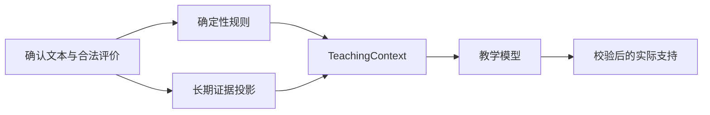

# AI 自讲：学习记忆架构（精简提案）

> 状态：后续阶段设计提案，产品决策已确认，尚未实现。
> 业务依据：[00-需求与Demo范围.md](../01-基本功能/00-需求与Demo范围.md)。
> 代码任务、字段细节和验收用例见 [04-代码实现方案（分任务）.md](./04-代码实现方案（分任务）.md)。

本文只说明记忆系统的架构边界和关键取舍，不重复代码任务中的 Schema、HTTP 错误体、迁移步骤和文件清单。

## 1. 结论与范围

记忆系统只解决三件事：

1. 保持同一会话连续：恢复后不遗忘已确认内容和已实际发送的支持。
2. 保存跨会话学习证据：记录某学生在某主知识点上的独立完成、支持后完成、解析后完成和明确错误。
3. 为评价后的教学提供有限上下文：减少重复提示，但不影响本次答案评价和业务状态转换。

第一版不建立瞬时记忆表、工作记忆表、通用学习事件账本、学生画像或 AI 长期总结。现有业务记录继续作为权威事实，临时上下文和长期聚合都必须能够从它们重建。

图只展示数据关系。状态转换、计数和阈值仍以需求文档和确定性规则代码为准。

## 2. 已冻结的产品决策

1. 教师可以查看全部学生会话和学生完整原始文本；学生只能查看和操作本人会话。
2. `questions` 保存题目逻辑身份，`questions.current_revision_id` 明确指向当前修订，不通过最大修订号推断。
3. 第一次评价模型只返回评价事实，移除 `feedback`、`nextAction`、`guidedQuestions`，不保留兼容业务字段。
4. 教学模型失败时不自动重试。合法评价保留，会话进入 `NEED_HUMAN + WAIT_STUDENT_ACTION`；不创建支持事件，也不增加支持计数。

## 3. 当前代码事实与前置条件

当前代码已有以下权威记录：

- `Session`：会话状态、阶段、轮次、计数和版本。
- `ExplanationAttempt`：学生确认后的自讲文本。
- `AIEvaluation`：结构化评价和模型调用审计。
- `SupportEvent`：实际发送的教学支持。
- `StateTransitionEvent`：状态变化记录。
- `StudentSubmission`：疑问、子问题答案、申诉等学生提交。

当前还不能可靠建立跨会话记忆，原因是：

- `sessions` 没有稳定的学生归属和创建者字段。
- `questions` 没有受控知识点映射。
- 题目内容会原地编辑，会话没有绑定创建时的题目修订。
- 当前评价模型同时返回评价、反馈和建议动作，职责尚未拆开。

因此，跨会话聚合前必须先完成：

1. 会话增加 `created_by_user_id` 和可空的 `student_id`。
2. 建立受控的 `knowledge_points` 目录，第一版一题只绑定一个主知识点。
3. 建立不可变 `question_revisions`，会话固定绑定 `question_revision_id`。
4. 先拆开评价调用、确定性决策和教学调用。

历史会话如果不能可靠确定学生归属或题目修订，应保留原记录但排除长期聚合，不允许猜测回填。

## 4. 权威数据与模型边界

### 4.1 权威数据

只有以下内容可以形成学习证据：

- 学生确认后的文本。
- 结构和关系校验通过的评价。
- 实际发送并落库的支持。
- 确定性状态事件、完成方式和人工处理结果。

草稿、ASR 候选文本、未通过校验的模型输出可以按恢复或审计要求保存，但不能更新长期证据。

### 4.2 评价与记忆隔离

第一次模型调用只读取当前题目修订的教学材料和当前确认文本。它不得读取长期记忆、其他题历史、原始计数、状态字段或学生画像。

合法评价产生后，后端先依据状态、计数和阈值计算教学动作。只有确实需要教学内容时，才构造 `TeachingContext` 并调用第二个模型。AI 不得直接修改状态、流程阶段、支持次数、完成方式或解析展示条件。

### 4.3 权限边界

`created_by_user_id` 用于权限归属，`student_id` 用于学习归因。学生会话两者均指向当前学生；教师试用会话只记录创建教师，`student_id` 为空且不进入学生长期记忆。

HTTP、WebSocket、时间线、审计和导出必须使用一致的权限范围。教师查看原始文本不等于模型可以读取全部历史，也不允许教师覆盖学生原始证据。

## 5. TeachingContext

`TeachingContext` 是第二次模型调用前由后端即时构造的有界 DTO，不是数据库表。它只包含：

- 当前题目修订的完整教学材料和当前确认文本。
- 本次合法评价、已覆盖点和目标评分点。
- 少量近期尝试和已实际发送的支持。
- 后端翻译后的教学元信息和动作约束。
- P1 才加入的当前主知识点有限长期证据。

原始 `round`、支持计数、无进展计数、支持上限、`flowStage`、记录 ID、版本号和精确时间不进入模型上下文。后端把它们翻译成有限枚举和指令，例如：

- `learningPhase`
- `supportBudgetState`
- `progressState`
- `solutionExposure`
- `allowedAction`
- `targetRubricPoint`
- `doNotRepeat`
- `doNotReveal`
- `responseGoal`

完整字段契约和长度限制只在代码实现方案中维护，避免两份文档发生漂移。

上下文压缩只做确定性选取和截断，不使用 AI 摘要，也不覆盖原文。当前确认文本、题目评分材料和最新合法评价保留完整；历史尝试和支持只保留避免重复所需的少量内容。

## 6. 长期记忆

### 6.1 知识点证据投影

第一版只建立 `student_knowledge_states`，按 `student_id + knowledge_point_id` 聚合：

- 独立完成次数。
- 支持后完成次数。
- 解析后完成次数。
- 明确错误次数。
- 达到支持上限次数。
- 最新证据时间、来源、算法版本和终态水位线。

另用 `student_knowledge_evidence_sources` 保存可重建的来源索引。两张表都是派生数据，权威事实仍是原始会话、评价、支持和状态事件。

每个有效终态会话对一个主知识点最多贡献一种完成证据、一份明确错误证据和一份停止上限证据。`UNCERTAIN`、无合法评价、无学生归属、题目版本未知或人工未决的会话不更新投影。

第一版不输出 `masteryScore` 或“掌握/薄弱”标签。证据计数只描述发生过什么，不等于经过校准的学习能力模型。

### 6.2 暂不实现

- 根据行为推断的教学偏好、人格和能力画像。
- 跨题自由文本错因聚合。
- AI 长期总结和学生档案。
- 向量数据库、通用 RAG、知识图谱和跨 Agent 共享记忆。
- 复杂遗忘曲线、BKT/IRT、自动推荐排序。
- 消息队列、增量双写、每日调度和后台自治反思。
- 重复建设的过程记忆表或通用学习事件账本。

若以后增加学生主动填写、查看、修改和撤销偏好的入口，再单独设计明确偏好表；当前阶段不预建。

## 7. 召回与重算

长期记忆只在评价完成后的教学阶段召回。固定顺序为：

1. 校验学生归属和权限。
2. 只选择当前题目主知识点。
3. 应用时间窗和证据有效性规则。
4. 降低已被后续独立完成削弱的旧错误优先级。
5. 限制来源数量并翻译成有限状态。

模型不接收学生 ID、会话 ID、原始计数、精确时间、算法版本或自由文本历史错误。没有有效证据时返回空记忆，不用向量搜索或自由文本补齐。

长期投影由确定性全量重算函数生成。会话进入 `COMPLETED` 或 `STOPPED_LIMIT` 后触发该学生重算，并保留人工管理命令。失败不回滚已完成会话，只保留旧投影并记录错误；召回发现投影版本或终态水位线过期时，拒绝旧投影并按空记忆处理。

## 8. 分阶段边界

### P0：完成当前会话双调用闭环

- 清理评价模型中的教学字段。
- 后端计算确定性教学动作并构造 `TeachingContext`。
- 增加独立教学模型调用。
- 教学输出校验通过后才创建支持事件和增加计数。
- 保持现有状态机、暂停恢复、语音和审计行为。

P0 不读取跨会话长期记忆。

### P1：增加最小跨会话记忆

- 增加会话身份与统一权限过滤。
- 增加知识点目录、题目修订和会话修订绑定。
- 从终态会话重算知识点证据及来源索引。
- 使用结构化 SQL 有界召回并接入 `TeachingContext`。

只有在 P1 的权限、来源追溯、过期拒绝和延迟独立表现验证不足后，才重新评估更复杂的记忆基础设施。

## 9. 验收边界

1. 本次答案评价不受长期记忆影响。
2. 模型不能决定状态、计数、阈值和完成方式。
3. 未实际发送的候选内容不形成支持事件或支持计数。
4. 召回只读取本人、当前主知识点和有效时间范围内的证据。
5. 每项长期聚合均可追溯并可从原始记录重建。
6. 记忆价值最终用延迟独立正确率、迁移题表现、重复提示率和人工纠错率验证。

## 10. 合理性批判与不足

1. `TeachingContext` 只能约束模型权限，不能保证教学内容质量；语义泄露、模糊提示和无效追问仍需离线样本与人工审核。
2. 不可变题目修订能保证历史可解释性，但会显著扩大题目 CRUD 和迁移范围；当前选择可靠性优先于最小改动。
3. 知识点证据计数可复核但表达能力有限，不能直接推导掌握概率或个性化策略。
4. 全量重算适合早期数据规模；规模增长后可能需要可验证的增量投影，但现在提前实现会增加一致性风险。
