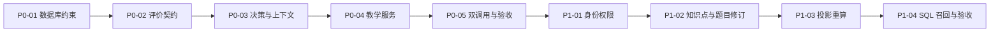

# AI 自讲记忆系统：代码实现方案（分任务）

> 状态：待实施。
> 架构依据：[03-学习记忆架构（精简提案）.md](./03-学习记忆架构（精简提案）.md)。
> 业务状态、计数和阈值仍以 [00-需求与Demo范围.md](../01-基本功能/00-需求与Demo范围.md) 为最高依据。

本文只保留能够直接转化为代码、迁移或测试的内容。每次只实施一个子任务，不提前实现后续阶段。

## 1. 当前代码差距

| 位置 | 当前实现 | 目标 |
| --- | --- | --- |
| `schemas/ai_evaluation.py` | 评价输出包含 `feedback`、`nextAction`、`guidedQuestions` | 评价只返回评价事实 |
| `models/ai_evaluation.py` | 持久化 `feedback`、`next_action` | 删除旧教学字段 |
| `repositories/sessions.py` | 评价、动作解释、支持落库耦合 | 评价、规则决策、教学生成、支持落库分层 |
| `api/sessions.py` | 先做普通版本比较，评价服务直接推进会话 | 原子 CAS 后进入双调用编排 |
| `models/session.py` | 无创建者、学生和题目修订 | P1 增加稳定归属和历史语义 |
| `models/question.py` | 题目内容原地更新，无知识点 | P1 增加知识点和不可变修订 |

## 2. 执行依赖



共享模型、仓储和 API 按依赖顺序修改。状态表或数据契约发生歧义时停止任务，先回到需求文档确认。

## 3. P0：当前会话双调用闭环

### P0-01：数据库约束与迁移基线

**目标**：让后续外键和表重建迁移真正生效，不改变教学业务行为。

**修改路径**：

- `backend/app/core/database.py`
- `backend/alembic/env.py`
- `backend/alembic/versions/<数据库约束迁移>.py`
- `backend/tests/integration/test_database.py`

**实现要求**：

1. SQLite 运行时新连接和 Alembic 在线迁移连接均启用 `PRAGMA foreign_keys = ON`。
2. 保留现有忙等待超时和连接检查。
3. 迁移前执行 `PRAGMA foreign_key_check`，发现违规时明确失败。
4. 后续删除列采用 SQLite 表重建迁移，保留必要索引和外键。

**验收**：新连接外键开关为 1；外键违规写入和迁移检查均失败；现有数据库测试通过。

### P0-02：评价模型契约清理

**目标**：第一次模型调用只产生可校验的评价事实。

**修改路径**：

- `backend/app/schemas/ai_evaluation.py`
- `backend/app/models/ai_evaluation.py`
- `backend/app/services/ai_evaluation.py`
- `backend/app/prompts/evaluate_explanation.md`
- `backend/app/repositories/sessions.py`（仅评价持久化）
- `backend/app/services/audit_trace.py`
- `backend/app/schemas/session.py`
- `frontend/src/types/session.ts`
- `frontend/src/views/SessionView.vue`
- `backend/alembic/versions/<删除评价教学字段迁移>.py`
- 相关单元、集成和前端测试

**评价输出字段**：

- `correctness`
- `completeness`
- `coveredPoints`
- `missingPoints`
- `errorEvidence`
- `confidence`
- `needHumanReason`

删除 `feedback`、`nextAction`、`guidedQuestions`。评价输出继续使用 `extra=forbid`；历史 `raw_response` 只作不透明审计原文，不能恢复旧业务字段。题目材料和 `SupportEvent` 中同名的引导问题字段不删除。

`UNCERTAIN` 必须带 `needHumanReason`，其他结果必须为空。评分点集合和错误原文引用仍按现有关系规则校验。

**验收**：旧字段被 Schema 拒绝，数据库和 API 不再包含旧字段，评价服务不再读取模型自报动作，当前评价不读取历史记忆或状态计数。

### P0-03：确定性教学决策与 TeachingContext

**目标**：后端从原始会话状态计算动作，再构造第二次模型调用的有界上下文。

**修改路径**：

- 新增 `backend/app/schemas/teaching.py`
- 新增 `backend/app/rules/teaching_decision.py`
- 新增 `backend/app/services/teaching_context.py`
- 必要时调整 `backend/app/rules/teaching_cycle.py` 的公开接口，不改变既有规则含义
- 新增 `backend/tests/unit/test_teaching_decision.py`
- 新增 `backend/tests/unit/test_teaching_context.py`

**初始动作映射**：

| 评价 | 后端动作 | 调用教学模型 |
| --- | --- | --- |
| `CORRECT + COMPLETE` | `COMPLETE` | 否 |
| `CORRECT + INCOMPLETE` | `ASK_FOCUSED_QUESTION` | 是 |
| `WRONG + COMPLETE` | `GIVE_CORRECTION` | 是 |
| `WRONG + INCOMPLETE` | `CORRECT_AND_ASK` | 是 |
| `UNCERTAIN` | `NEED_HUMAN` | 否 |

既有支持上限、无进展、解析展示和第二轮规则可覆盖初始动作，但只能由后端规则执行。完成、人工处理、展示解析和等待学生操作不调用教学模型。

**TeachingContext V1**：

```yaml
schemaVersion: "1.0"
task:
  questionContent: string
  standardAnswer: string
  rubricPoints: string[]
  commonErrors: string[]
  alternativeSolutions: string[]
  layeredHints: string[]
  guidedQuestions: string[]
  fullSolution: string
  currentStudentText: string
latestEvaluation:
  correctness: CORRECT | WRONG | UNCERTAIN
  completeness: COMPLETE | INCOMPLETE
  coveredPoints: string[]
  missingPoints: string[]
  errorEvidence: ErrorEvidence[]
learningProgress:
  alreadyCoveredPoints: string[]
  newlyCoveredPoints: string[]
  targetRubricPoint: string | null
teachingHistory:
  recentAttempts: RecentAttempt[]
  alreadyGivenSupports: GivenSupport[]
  historyTruncated: boolean
teachingMetadata:
  learningPhase: FIRST_ROUND | REEXPLANATION_AFTER_SOLUTION
  supportBudgetState: EARLY | NORMAL | APPROACHING_LIMIT | FINAL_ALLOWED_SUPPORT | EXHAUSTED
  progressState: MAKING_PROGRESS | NO_NEW_PROGRESS
  solutionExposure: FORBIDDEN | ALREADY_SHOWN_DO_NOT_REPEAT
instructionFromRules:
  allowedAction: ASK_FOCUSED_QUESTION | GIVE_HINT | GIVE_CORRECTION | CORRECT_AND_ASK
  targetRubricPoint: string | null
  doNotRepeat: string[]
  doNotReveal: string[]
  responseGoal: string
longTermEvidence: null
```

P0 的 `longTermEvidence` 固定为空。历史只保留最近 2 次尝试和最多 9 条实际支持，并使用确定性字符截取；不做 AI 摘要。模型不接收原始轮次、计数、状态、记录 ID、版本号和精确时间。

**验收**：相同输入得到相同决策；所有评价组合、支持上限、第二轮和解析分支有单元测试；未发送候选不进入历史；规则不允许生成时不构造上下文。

### P0-04：独立教学模型服务

**目标**：第二次模型调用只填写后端已选动作所需的教学内容。

**修改路径**：

- 新增 `backend/app/services/ai_teaching.py`
- 新增 `backend/app/prompts/generate_teaching.md`
- 修改 `backend/app/schemas/teaching.py`
- 新增 `backend/tests/unit/test_ai_teaching.py`

**输出契约**：

```json
{
  "content": "面向学生的教学内容",
  "questions": [{"id": "q1", "question": "一个引导问题"}]
}
```

只允许 `content` 和 `questions`。`ASK_FOCUSED_QUESTION`、`CORRECT_AND_ASK` 恰好返回 1 个问题；`GIVE_CORRECTION`、`GIVE_HINT` 返回空数组。禁止返回动作、状态、计数、阈值、完成方式和解析控制字段。

运行时只做确定性硬校验：JSON 结构、额外字段、非空、长度、问题数量、完全重复，以及标准答案或完整解析原文的直接包含。语义改写泄露、目标归属和教学质量进入离线评测，不伪装成确定性保证。

服务记录独立的 `AI_TEACHING` 外部调用，不写会话、支持或计数。异常直接返回明确错误，不自动重试。

**验收**：越权字段和错误问题数量被拒绝；模型异常、解析失败和硬校验失败可区分；服务单测不依赖业务状态落库。

### P0-05：双调用编排、失败事务与 P0 验收

**目标**：完成“评价落库 -> 规则裁决 -> 按需教学生成 -> 实际支持落库”的提交链路。

**修改路径**：

- `backend/app/api/sessions.py`
- `backend/app/repositories/sessions.py`
- `backend/app/schemas/session.py`
- 必要的前端错误展示与类型
- `backend/tests/integration/test_sessions.py`
- `backend/tests/integration/test_ai_evaluation.py`
- `backend/tests/integration/test_learning_timeline.py`
- 双调用失败场景测试

**执行顺序**：

1. 用会话 `version` 执行数据库原子 CAS，失败返回 `409 SESSION_VERSION_CONFLICT`。
2. 保存确认文本和尝试记录。
3. 调用评价服务并保存合法评价。
4. 计算覆盖点、无进展计数和确定性决策。
5. 无需教学时保存规则结果并返回。
6. 需要教学时构造上下文并调用教学服务。
7. 只有输出校验通过后才创建 `SupportEvent`、增加支持计数和推进状态。

教学失败保留合法评价以及已计算的覆盖/无进展结果，记录外部调用错误和 `TEACHING_GENERATION_FAILED` 状态事件，将会话设置为 `NEED_HUMAN + WAIT_STUDENT_ACTION` 并增加版本；不创建支持事件、不增加支持计数，返回固定 `502` 错误，且不暴露供应商原始错误。

成功提交响应可带瞬时 `teachingGeneration`：只允许 `NOT_REQUIRED | SUCCEEDED`；普通 GET 返回 `null`，失败通过错误响应表达。

**验收**：并发提交最多产生一条合法评价；教学失败无支持副作用；教学成功的事件、计数、状态和响应 ID 一致；暂停恢复、申诉、语音和时间线回归通过；请求 ID 能关联两次模型调用及业务事件。

P0 完成后仍不读取跨会话长期记忆。

## 4. P1：最小跨会话记忆

### P1-01：会话身份与统一权限

**修改路径**：

- `backend/app/models/session.py`
- `backend/app/schemas/session.py`、`backend/app/schemas/audit.py`
- `backend/app/repositories/sessions.py`
- `backend/app/api/sessions.py`、`backend/app/api/audit.py`
- `backend/alembic/versions/<会话身份迁移>.py`
- 会话、时间线、暂停恢复和语音权限测试

新增 `created_by_user_id` 和可空 `student_id`。学生创建会话时两者均为当前学生；教师试用时只写创建者。历史未知记录保持为空并排除长期聚合。

学生只能访问本人会话，越权按资源不存在处理；教师可查看全部学生会话和完整原始文本，但不因此获得修改学生证据的权限。HTTP、WebSocket、时间线、审计和导出使用同一权限过滤。

**验收**：所有入口完成学生隔离；教师查询不被学生过滤误伤；WebSocket 建连前校验；历史归属不被猜测回填。

### P1-02：知识点目录、题目修订与会话绑定

**修改路径**：

- 新增 `backend/app/models/knowledge_point.py`
- 新增 `backend/app/models/question_revision.py`
- 新增 `backend/app/schemas/knowledge_point.py`
- 修改题目、会话的模型、Schema、仓储和 API
- `backend/alembic/versions/<知识点与题目修订迁移>.py`
- 题目和会话相关单元、集成测试

**数据契约**：

- `knowledge_points` 保存唯一 `code`、名称、学科、学段和 `archived_at`。
- `questions` 只保留逻辑身份、当前修订指针和归档信息。
- `question_revisions` 保存完整题目材料、修订号、主知识点、创建者和时间。
- `questions.current_revision_id` 是唯一当前修订指针。
- 新会话复制当前指针到 `sessions.question_revision_id`，旧会话不随题目编辑变化。
- 第一版每个可用题目修订必须且只能绑定一个主知识点，保留自然语言 `rubricPoints`。

题目编辑创建下一不可变修订并更新当前指针。SQLite 使用写事务和 `UNIQUE(question_id, revision_number)` 防止并发重复。历史会话无法识别真实版本时保持空值并排除聚合。

**验收**：新题产生修订 1；编辑不改变旧修订；并发编辑无重复修订号；旧会话读取旧材料；归档知识点不能用于新修订；缺失主知识点的题目不能创建新学生会话。

### P1-03：证据投影、来源索引与重算

**修改路径**：

- 新增 `backend/app/models/student_knowledge_state.py`
- 新增 `backend/app/models/student_knowledge_evidence_source.py`
- 新增 `backend/app/rules/student_memory.py`
- 新增 `backend/app/repositories/student_memory.py`
- 新增 `backend/app/services/student_memory_rebuild.py`
- 新增 `backend/app/commands/rebuild_student_memory.py`
- `backend/alembic/versions/<学生知识点投影迁移>.py`
- 对应单元和集成测试

**聚合字段**：按 `student_id + knowledge_point_id` 唯一，记录独立完成、支持后完成、解析后完成、明确错误、停止上限的次数，以及最新证据时间、最新来源、算法版本和终态水位线。来源索引按学生、知识点、会话、证据类型和算法版本唯一。

**分类规则**：

1. 只读取有学生归属、题目修订和主知识点的 `COMPLETED`、`STOPPED_LIMIT` 终态会话。
2. `CORRECT + COMPLETE` 按完成方式计入一种完成证据。
3. 只有 `WRONG` 且有合法 `errorEvidence` 才计明确错误；`INCOMPLETE` 不等于错误。
4. `STOPPED_LIMIT` 不计完成，只计停止上限；若有明确错误可同时计一次错误。
5. `UNCERTAIN`、人工未决、版本未知和无合法评价不更新投影。
6. 同一输入和算法版本必须得到相同结果；来源和聚合在同一事务中替换。

终态提交后同步触发该学生全量重算，并提供人工命令。失败不回滚会话，只记录错误并保留旧投影。召回发现算法版本或终态水位线过期时拒绝投影。

**验收**：删除派生表后可从原始记录重建相同结果；每项计数可追溯；教师试用和历史未知会话不进入聚合。

### P1-04：SQL 召回、TeachingContext 接入与 P1 验收

**修改路径**：

- 新增 `backend/app/repositories/memory_recall.py`
- 修改 `backend/app/core/config.py`、`.env.example`
- 修改 `backend/app/services/teaching_context.py`
- 修改双调用编排入口
- 新增召回单元和集成测试
- 补充跨会话端到端验收测试

**固定召回顺序**：权限过滤 -> 当前主知识点 -> 时间窗 -> 证据优先级 -> 数量限制 -> 有限状态翻译。无结果时返回空集合，不使用自由文本或向量检索补齐。

V1 初始配置为最近 180 天、最多 3 个来源，并绑定 `rules_version`。模型只接收：

- `independentCompletionState: NONE | ONE | MULTIPLE`
- `supportEvidenceState: NONE | PRESENT_WITHOUT_INDEPENDENT | MIXED`
- `recentErrorPriority: NONE | NORMAL | LOWERED`
- `evidenceRecency: RECENT | STALE`
- 最多 3 个有限枚举 `recallReasons`

来源 ID、原始计数、精确时间、算法版本和错误自由文本只用于后端审计。评价模型始终不读取长期记忆。

**验收**：不越权、不跨知识点、不读取过期投影；结果数量受限且来源可追溯；启用记忆不改变评价和状态规则；对照记录重复提示率、人工纠错率和延迟独立正确率。

## 5. 交付检查

每个子任务完成后必须：

1. 运行该任务相关单元、集成或前端测试。
2. 执行 `git status --short`、`git diff` 和 `git diff --check`。
3. 只暂存本任务修改的明确文件路径并创建一次提交，不推送。
4. 汇报实际契约变化、测试结果、提交哈希和未实施的后续范围。

## 6. 合理性批判与不足

1. P0 会改变现有评价响应和数据库列，属于破坏性契约迁移；必须同步检查时间线、审计和前端消费，不能只改模型 Schema。
2. P1-02 的不可变题目修订横跨题目 CRUD 和会话读取，改动面明显大于记忆聚合本身；可靠历史语义是收益，迁移复杂度是主要代价。
3. 同步全量重算实现简单且可追溯，但可能增加终态请求延迟；当前数据规模可接受，达到可观测性能瓶颈后再改异步。
4. 有限 SQL 召回牺牲了开放语义检索能力，但能先验证权限、来源和学习收益，适合当前 Demo 阶段。
