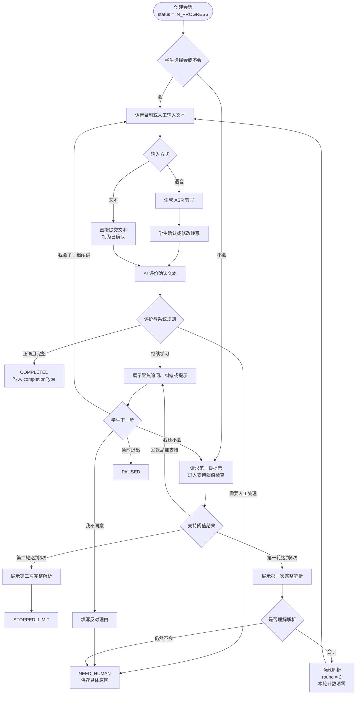
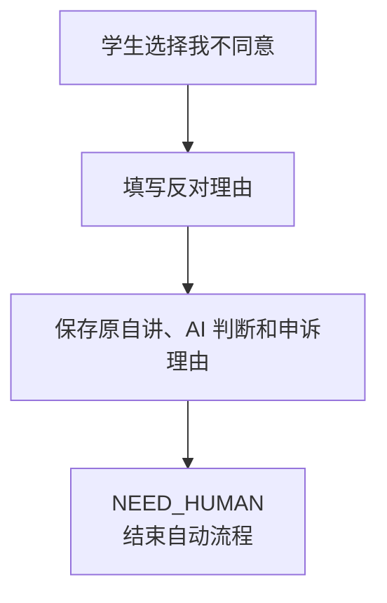

# AI 自讲 Demo 流程设计

## 1. 文档目的

本文档根据《00-需求与Demo范围.md》描述 AI 自讲 Demo 的业务流程、数据契约、状态转换、支持计数和结束规则。

状态转换表、计数规则和数据契约是后续实现与测试的依据；Mermaid 流程图只用于展示，不作为独立规则来源。

Demo 验证以下闭环：

1. 学生选择“会”或“不会”。
2. 学生通过语音或人工输入文本完成自讲。
3. 语音输入经过 ASR 后，由学生确认或修改转写。
4. AI 根据学生最终确认的文本评价正确性和完整性。
5. AI 引用学生原话指出错误或缺失，并通过有限追问和提示引导学生继续自讲。
6. 第一轮达到 6 次有效支持时展示完整解析，隐藏解析后进入第二轮自讲。
7. AI 判定正确且完整时完成；第二轮达到 3 次有效支持时结束；需要人工处理时停止自动流程。

## 2. 核心约定

### 2.1 AI 的评价输入

学生可以使用两种输入方式：

- **语音输入**：录制原始音频，生成 ASR 转写，学生确认或修改后提交。
- **人工输入文本**：学生直接输入文本，提交后视为已经确认。

AI 只评价学生最终确认的文本。原始音频和 ASR 原始转写需要保存，但不直接用于判断学生是否正确。

系统不要求 ASR 置信度，也不要求学生或人工标记转写质量。

### 2.2 学生操作

会话开始时，学生先选择：

- **会**：直接进入本轮自讲。
- **不会**：请求第一级提示，第一级提示计为一次有效支持。

AI 每次给出非终态回复后，学生可以选择：

- **我会了，继续讲**：进入新的自讲，不代表已经完成。
- **我还不会，再提示一点**：请求下一层提示或纠错。
- **我不同意 AI 判断**：填写反对理由，随后直接进入 `NEED_HUMAN`。
- **暂时退出**：保存会话，后续恢复。

### 2.3 AI 评价维度

AI 返回两个独立评价维度：

- 正确性：`CORRECT`、`WRONG`、`UNCERTAIN`。
- 完整性：`COMPLETE`、`INCOMPLETE`。

只有 `CORRECT + COMPLETE` 可以完成。`UNCERTAIN` 不单独形成 `AI_UNCERTAIN` 状态，统一进入 `NEED_HUMAN`。

### 2.4 自讲轮次

- `round = 1`：第一次自讲。即将产生第 6 次有效支持时，不发送该次局部支持，直接展示完整解析。
- `round = 2`：看过第一次完整解析后的第二次自讲。即将产生第 3 次有效支持时，不发送该次局部支持，再次展示完整解析并进入 `STOPPED_LIMIT`。

第一轮展示完整解析后，学生选择已经理解时，系统必须隐藏解析、清零本轮支持次数，并要求学生从头进行第二次完整自讲。查看解析本身不能算完成。

### 2.5 业务状态和完成标签

会话业务状态只有：

- `IN_PROGRESS`
- `COMPLETED`
- `STOPPED_LIMIT`
- `NEED_HUMAN`
- `PAUSED`

独立完成、提示后完成和查看解析后完成不再拆分为业务状态，而是写入 `completionType`：

- `INDEPENDENT`
- `WITH_SUPPORT`
- `AFTER_SOLUTION`

## 3. 数据契约

### 3.1 题目输入

每道题至少包含：

| 字段 | 含义 |
|---|---|
| `questionContent` | 题目内容 |
| `standardAnswer` | 标准答案 |
| `rubricPoints` | 必须讲出的关键评分点 |
| `commonErrors` | 常见错误 |
| `alternativeSolutions` | 可接受的其他解法 |
| `layeredHints` | 按层级排列的提示 |
| `fullSolution` | 完整解析 |

以上内容由人工录入，不由系统自动生成。

### 3.2 学生自讲输入

每次自讲至少保存：

| 字段 | 含义 |
|---|---|
| `inputMode` | `VOICE` 或 `TEXT` |
| `audio` | 原始音频；文本输入时为空 |
| `asrTranscript` | ASR 原始转写；文本输入时为空 |
| `confirmedText` | 学生确认、修改或直接输入的最终文本 |
| `confirmedAt` | 文本确认或提交时间 |

`confirmedText` 是 AI 评价的唯一学生表达输入。空文本必须在进入 AI 评价前被拦截并提示学生重新提交。

### 3.3 AI 结构化评价

AI 每次评价必须返回：

| 字段 | 约束 |
|---|---|
| `correctness` | `CORRECT`、`WRONG`、`UNCERTAIN` |
| `completeness` | `COMPLETE`、`INCOMPLETE` |
| `coveredPoints` | 本次确认文本覆盖的评分点列表 |
| `missingPoints` | 本次确认文本缺失的评分点列表 |
| `errorEvidence` | 引用学生原话的错误证据；没有明确错误时为空列表 |
| `feedback` | 面向学生的简短反馈 |
| `confidence` | Demo 阶段固定为数字 `1` |
| `nextAction` | 下一教学动作 |
| `needHumanReason` | `nextAction = NEED_HUMAN` 时必填，其他情况为空 |

`nextAction` 可取：

- `COMPLETE`
- `ASK_FOCUSED_QUESTION`
- `GIVE_CORRECTION`
- `CORRECT_AND_ASK`
- `GIVE_HINT`
- `NEED_HUMAN`

`confidence` 不参与任何业务判断。系统根据正确性、完整性、`nextAction`、当前轮次和计数器执行确定性状态转换。

AI 认为确认文本仍存在严重歧义、自己的前后判断矛盾或其他无法继续自动评价的情况时，可以返回 `nextAction = NEED_HUMAN`，并在 `needHumanReason` 中说明具体原因。原因使用自由文本，不拆分独立标签。

### 3.4 会话结果

会话至少保存：

| 字段 | 含义 |
|---|---|
| `status` | 当前业务状态 |
| `completionType` | 完成方式；未完成时为空 |
| `round` | 当前轮次，取值为 1 或 2 |
| `supportCountRound` | 当前轮有效支持次数 |
| `supportCountTotal` | 全会话有效支持总次数 |
| `noProgressCount` | 连续未新增评分点次数 |
| `solutionExposed` | 是否展示过完整解析 |
| `needHumanReason` | 需要人工处理的具体原因 |

## 4. 主流程



## 5. AI 评价规则

AI 负责生成评价和教学建议，不直接决定最终业务状态。系统按照下表解释评价结果：

| 正确性 | 完整性 | AI 建议动作 | 系统动作 | 是否计支持 |
|---|---|---|---|---|
| `CORRECT` | `COMPLETE` | `COMPLETE` | 进入 `COMPLETED`，计算完成标签 | 否 |
| `CORRECT` | `INCOMPLETE` | `ASK_FOCUSED_QUESTION` | 只追问缺失评分点 | 否 |
| `WRONG` | `COMPLETE` | `GIVE_CORRECTION` | 指出错误位置，进入支持阈值检查 | 是 |
| `WRONG` | `INCOMPLETE` | `CORRECT_AND_ASK` | 指出错误并追问缺失评分点，进入支持阈值检查 | 是，只计一次 |
| `UNCERTAIN` | 任意 | `NEED_HUMAN` | 进入 `NEED_HUMAN` | 否 |
| 任意 | 任意 | `NEED_HUMAN` | 保存 `needHumanReason` 并进入 `NEED_HUMAN` | 否 |

评价反馈必须满足：

1. 明确引用学生确认文本中的原话。
2. 说明具体哪一步有问题。
3. 说明为什么有问题。
4. 给出下一步应思考的方向。
5. 在需要继续学习时避免直接泄露完整答案。
6. 对可接受的其他解法，以题目中录入的其他解法和评分点进行判断。

## 6. 支持与阈值规则

### 6.1 有效支持

以下动作各计一次有效支持：

- `GIVE_HINT`
- `GIVE_CORRECTION`
- `CORRECT_AND_ASK`

`CORRECT_AND_ASK` 同时包含纠错和追问，但只计一次。

以下情况不计入有效支持次数：

- `ASK_FOCUSED_QUESTION`
- 学生申诉
- 空输入被拦截
- 语音录制或 ASR 服务失败
- 网络错误、模型超时和服务异常
- 展示完整解析

### 6.2 阈值判断

系统准备发送计数支持时，必须先计算 `nextSupportCount`，再决定是否真正发送：

```text
nextSupportCount = supportCountRound + 1

如果 round == 1 且 nextSupportCount >= 6：
    supportCountRound = 6
    solutionExposed = true
    不发送第 6 次局部支持
    展示第一次完整解析

    如果学生选择“会了”：
        隐藏完整解析
        round = 2
        supportCountRound = 0
        要求学生从头进行第二次完整自讲

    如果学生选择“仍然不会”：
        status = NEED_HUMAN
        保存具体原因

否则如果 round == 2 且 nextSupportCount >= 3：
    supportCountRound = 3
    solutionExposed = true
    不发送第 3 次局部支持
    展示第二次完整解析
    status = STOPPED_LIMIT

否则：
    创建一条 VALID 支持事件
    supportCountRound += 1
    supportCountTotal += 1
    发送本次局部支持
```

到达阈值时，`supportCountRound` 记录为阈值值，用于表达流程已经触发上限；未实际发送的阈值支持不创建 `VALID` 支持事件，也不增加 `supportCountTotal`。

### 6.3 连续无进展

`ASK_FOCUSED_QUESTION` 不计入支持次数，因此必须限制重复追问：

```text
如果学生本次确认文本覆盖了新的评分点：
    noProgressCount = 0

否则：
    noProgressCount += 1

如果 noProgressCount >= 2：
    下一次 ASK_FOCUSED_QUESTION 升级为 GIVE_HINT
    GIVE_HINT 进入正常阈值检查并计入有效支持
```

“新的评分点”指相对于本会话此前所有已覆盖评分点，本次首次覆盖的 `rubricPoints`。

### 6.4 支持事件

每次实际发送的计数支持保存独立事件：

| 字段 | 含义 |
|---|---|
| `supportType` | `GIVE_HINT`、`GIVE_CORRECTION` 或 `CORRECT_AND_ASK` |
| `round` | 发生轮次 |
| `status` | 当前固定为 `VALID` |
| `createdAt` | 发送时间 |

原设计中的 `INVALID_AI_RETRACTED` 不再需要，因为学生申诉后不进行 AI 复核，也不会撤销此前支持事件。

## 7. 申诉与人工处理

### 7.1 学生申诉

学生选择“我不同意 AI 判断”后：

1. 必须填写反对理由。
2. 保存题目、确认文本、原 AI 结构化评价、AI 反馈和反对理由。
3. 不进行 AI 二次复核。
4. 不增加或撤销支持次数。
5. 立即设置 `status = NEED_HUMAN`。
6. `needHumanReason` 记录学生申诉及其理由。
7. 自动流程结束。



### 7.2 其他人工处理情况

以下情况进入 `NEED_HUMAN`：

- AI 返回 `correctness = UNCERTAIN`。
- AI 认为确认文本存在严重歧义，无法可靠评价。
- AI 识别到自己的前后判断矛盾。
- 学生提出申诉。
- 第一轮展示完整解析后，学生仍然表示不会。
- AI 判断存在其他无法继续自动处理的问题。

大模型只需输出具体 `needHumanReason`，不要求用标签区分原因。系统收到 `nextAction = NEED_HUMAN` 后确定性地转换状态。

`NEED_HUMAN` 是本阶段终态。系统只报告并保存原因，不实现人工派单、复核界面、人工处理或复核后更新状态。

## 8. 状态转换表

### 8.1 业务状态

| 当前状态 | 触发条件 | 下一状态 | 系统行为 |
|---|---|---|---|
| 新会话 | 会话创建成功 | `IN_PROGRESS` | 等待学生选择“会”或“不会” |
| `IN_PROGRESS` | AI 判定 `CORRECT + COMPLETE` | `COMPLETED` | 计算并保存 `completionType` |
| `IN_PROGRESS` | 第二轮达到 3 次支持阈值 | `STOPPED_LIMIT` | 展示完整解析并结束 |
| `IN_PROGRESS` | AI 无法可靠判断或建议人工处理 | `NEED_HUMAN` | 保存具体原因并结束 |
| `IN_PROGRESS` | 学生提交申诉理由 | `NEED_HUMAN` | 保存申诉证据并结束 |
| `IN_PROGRESS` | 第一轮看完解析后仍然不会 | `NEED_HUMAN` | 保存具体原因并结束 |
| `IN_PROGRESS` | 学生暂时退出 | `PAUSED` | 保存暂停前流程阶段 |
| `PAUSED` | 学生恢复 | `IN_PROGRESS` | 恢复暂停前流程阶段和计数器 |
| `COMPLETED` | 终态 | - | 不允许继续自动自讲 |
| `STOPPED_LIMIT` | 终态 | - | 不允许继续自动自讲 |
| `NEED_HUMAN` | 终态 | - | 本阶段不实现状态更新 |

### 8.2 流程阶段

业务状态表示会话结果，`flowStage` 表示 `IN_PROGRESS` 或 `PAUSED` 会话当前停留的位置：

| `flowStage` | 含义 |
|---|---|
| `WAIT_INITIAL_CHOICE` | 等待学生选择会或不会 |
| `CAPTURING_INPUT` | 等待语音或文本输入 |
| `TRANSCRIBING` | 正在进行 ASR 转写 |
| `CONFIRMING_TEXT` | 等待学生确认或修改转写 |
| `AI_EVALUATING` | AI 正在评价确认文本 |
| `WAIT_STUDENT_ACTION` | 已展示 AI 回复，等待下一步操作 |
| `SHOWING_FULL_SOLUTION` | 正在展示完整解析 |

### 8.3 学生操作转换

| 学生操作 | 前置条件 | 系统动作 |
|---|---|---|
| 会 | `WAIT_INITIAL_CHOICE` | 进入第一轮自讲输入 |
| 不会 | `WAIT_INITIAL_CHOICE` | 请求第一级提示并进行阈值检查 |
| 我会了，继续讲 | `WAIT_STUDENT_ACTION` | 打开本轮自讲输入，不直接完成 |
| 我还不会，再提示一点 | `WAIT_STUDENT_ACTION` | 请求下一层支持并进行阈值检查 |
| 我不同意 AI 判断 | 已展示 AI 判断 | 要求填写理由，提交后进入 `NEED_HUMAN` |
| 暂时退出 | 非终态 | 保存上下文并进入 `PAUSED` |
| 看懂第一次完整解析 | 第一轮解析展示后 | 隐藏解析，进入第二轮完整自讲 |
| 未看懂第一次完整解析 | 第一轮解析展示后 | 进入 `NEED_HUMAN` |

## 9. 完成方式判定

系统进入 `COMPLETED` 时，按确定性规则写入标签：

```text
如果 solutionExposed == true 且 round == 2：
    completionType = AFTER_SOLUTION

否则如果 supportCountTotal > 0：
    completionType = WITH_SUPPORT

否则：
    completionType = INDEPENDENT
```

`completionType` 只用于统计，不改变 `status = COMPLETED`。

## 10. 示例

### 10.1 语音输入并独立完成

1. 学生选择“会”。
2. 学生录制语音，系统生成 ASR 转写。
3. 学生修正转写中的数字后确认。
4. AI 评价确认文本为 `CORRECT + COMPLETE`。
5. 系统进入 `COMPLETED`。

```text
status = COMPLETED
completionType = INDEPENDENT
supportCountTotal = 0
solutionExposed = false
```

### 10.2 人工输入文本并在提示后完成

1. 学生直接输入自讲文本。
2. AI 判断 `WRONG + INCOMPLETE`，引用错误原话并返回 `CORRECT_AND_ASK`。
3. 系统发送组合反馈并记录一次有效支持。
4. 学生再次输入文本，AI 判断 `CORRECT + COMPLETE`。

```text
status = COMPLETED
completionType = WITH_SUPPORT
supportCountTotal = 1
```

### 10.3 第一轮达到 6 次支持

```text
round = 1
supportCountRound = 5
nextSupportCount = 6
```

系统不发送第 6 次局部支持，将 `supportCountRound` 记为 6，并展示第一次完整解析。学生选择“会了”后，系统隐藏解析：

```text
status = IN_PROGRESS
round = 2
supportCountRound = 0
solutionExposed = true
```

学生必须从头进行第二次完整自讲。

### 10.4 看解析后完成

学生在第二轮重新自讲，AI 判断 `CORRECT + COMPLETE`：

```text
status = COMPLETED
completionType = AFTER_SOLUTION
round = 2
```

### 10.5 第二轮达到 3 次支持

```text
round = 2
supportCountRound = 2
nextSupportCount = 3
```

系统不发送第 3 次局部支持，展示第二次完整解析并结束：

```text
status = STOPPED_LIMIT
supportCountRound = 3
solutionExposed = true
```

### 10.6 学生申诉

学生填写反对理由后，系统不调用 AI 复核：

```text
status = NEED_HUMAN
needHumanReason = 学生不同意 AI 判断：<学生填写的理由>
```

### 10.7 AI 无法可靠判断

AI 返回：

```text
correctness = UNCERTAIN
confidence = 1
nextAction = NEED_HUMAN
needHumanReason = 当前确认文本无法说明辅助线是否满足题目条件，无法可靠判断证明是否成立。
```

系统转换为：

```text
status = NEED_HUMAN
```

## 11. Demo 统计指标

本阶段只统计：

1. 错误自讲被判为 `COMPLETED` 的比例，即错误放行率。
2. 正确自讲被判为错误的比例，即正确误判率。
3. 正确但不完整的自讲被识别为 `CORRECT + INCOMPLETE` 的比例。

人工审核提供实际正确性和完整性真值。系统不固化目标阈值、最低样本量、题目分布、审核人数、分歧处理规则或可接受的不确定率，也不实现人工审核功能。

## 12. 完整记录要求

每轮至少记录：

- 原始音频，如有。
- ASR 原始转写，如有。
- 学生确认或直接输入的文本。
- AI 结构化评价。
- AI 给学生的反馈。
- 学生下一轮回答和操作。
- 支持事件、轮次和计数器变化。
- 完整解析是否展示。
- 最终状态和完成标签。
- 申诉理由或人工处理原因，如有。
- 每一步耗时。

## 13. 暂不实现范围

- AI 申诉复核。
- 离线人工复核、派单、处理和状态回写。
- 门店运营和伴学师实时接管。
- 学生分层与动态学习规划。
- 跨学科学习任务。
- 自动生成题目和评分量规。
- 变式题和隔天检测。
- 家长报告和门店经营数据。
- 大规模并发与成本优化。
- ASR 置信度和人工转写质量标签。
- 未成年人数据治理规则。

## 14. 合理性批判与不足

1. AI 只评价学生确认文本，可以隔离 ASR 错误对评价的影响，但无法用评价指标证明 ASR 已经准确听懂学生原始语音。
2. 第一轮 6 次、第二轮 3 次保留了原流程的连续性，但阈值属于经验值，可能导致学生反复交互时间较长。
3. 学生申诉后直接停止自动流程，有利于避免 AI 在争议中继续误导，但会提高 `NEED_HUMAN` 数量，且本阶段没有配套处理闭环。
4. `needHumanReason` 使用自由文本便于快速实现，但无法稳定统计不同人工处理原因，也不适合直接作为长期数据标准。
5. `confidence` 固定为 `1` 只能满足暂时的数据结构要求，不能用于衡量评价可靠性或制定自动放行策略。
