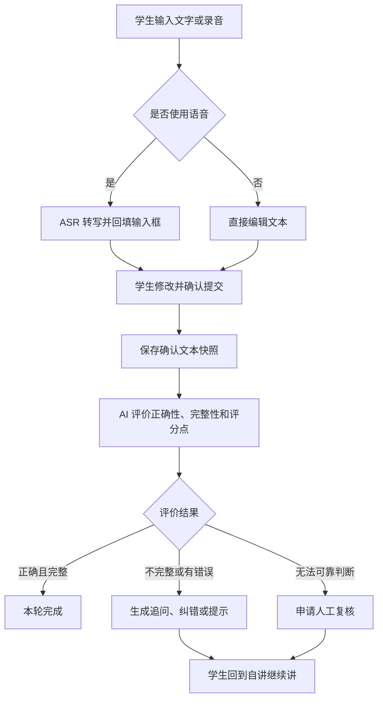
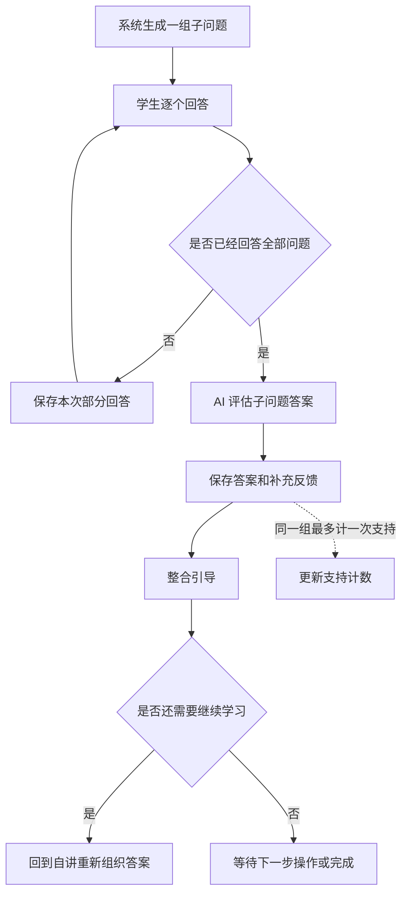
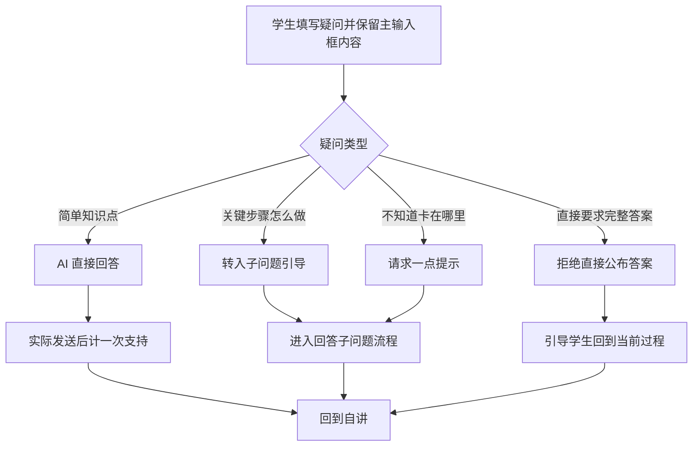
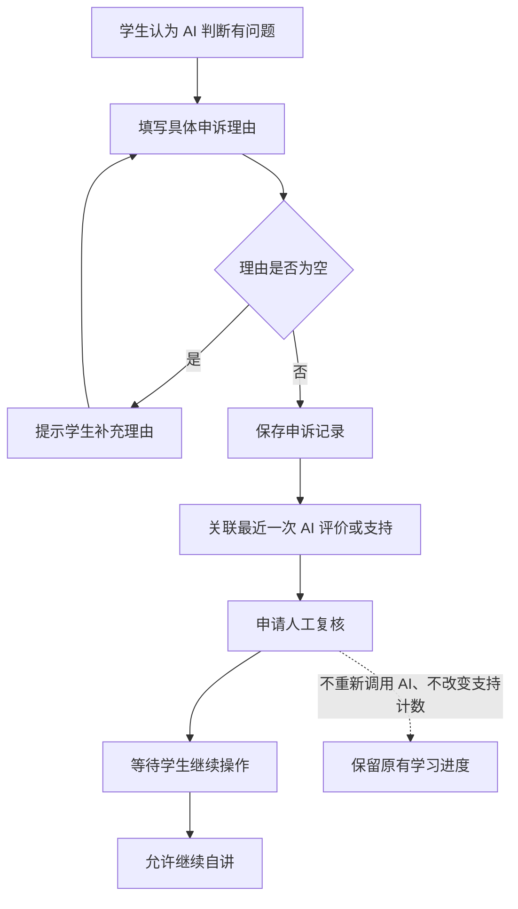

# AI 自讲 Demo 项目汇报

## 1. 项目想解决什么问题

让学生先自己讲一道题，再由 AI 判断学生哪里已经理解、哪里还没有讲清楚。

系统的目标不是尽快把答案显示出来，而是让学生在自己的讲解、回答和提问中逐步补全思路。AI 负责理解内容、指出问题和生成合适的教学内容；学习流程、支持次数和结束条件由系统规则控制。

## 2. 项目中有哪些角色

### 学生

学生可以输入文字，也可以录音。录音会先转换成文字，学生修改后再提交。学习过程中，学生可以自讲、回答子问题、提出疑问，或者说明 AI 的判断有问题。

### 题目录入人员

题目录入人员准备题目内容、标准答案、关键评分点、常见错误、其他解法、分层提示、可选子问题和完整解析。这些材料是 AI 评价和教学时使用的依据。

### 人工处理人员

AI 无法可靠判断或学生提出申诉时，系统会保存具体原因并申请人工复核。当前 Demo 只记录和报告这件事，不包含完整的人工派单和处理页面。

## 3. 学习页面的四个入口

学习页面的“当前解题过程”有四个入口。它们属于同一个学习会话，但处理的事情不同。

### 3.1 自讲

这是主要入口。学生在主输入框中写下或说出自己的解题思路，然后提交。

提交时，系统保存这次确认过的文本快照，并让 AI 从两个方面评价：

- 讲解是否正确；
- 讲解是否完整，是否覆盖了题目要求的关键点。

AI 还需要引用学生自己的原话，说明错误或缺少的地方。评价完成后，系统根据结果决定下一步：直接完成、继续追问、纠错提示，或者申请人工复核。

主输入框里的草稿可以继续修改，但每次提交的确认文本都会单独保存，历史记录不会被后来内容覆盖。



### 3.2 回答子问题

当学生暂时讲不下去时，系统可以给出一组较小的引导问题。例如先询问一个必要概念，再让学生说明某一步为什么成立。

学生可以逐个回答这些问题。回答提交后，系统会保存：

- 学生回答了哪些子问题；
- 哪些回答已经正确；
- AI 对回答的补充说明；
- 最后的整合引导。

一组子问题、学生的多次回答和最后的反馈属于同一次支持，最多计一次有效支持，不会因为页面上出现多条消息就重复计数。

如果学生回答后仍然需要继续学习，通常会回到“自讲”，把刚才的理解重新讲回主输入框。



### 3.3 我有疑问

学生可以单独写下自己想问的问题，同时保留主输入框中的当前解题过程。

系统会区分两种情况：

- 如果是一个简单的知识点问题，AI 可以直接回答。回答实际发送后计一次有效支持，但不增加“我不会”请求的连续无进展次数。
- 如果学生问的是“这一步具体应该怎么做”，系统会转入子问题引导流程，和“我不会，给我一点提示”使用同一套规则。

如果学生只知道自己卡住了、说不清具体疑问，也可以直接请求一点提示。若学生直接要求完整答案，系统会先拒绝直接公布答案，引导学生回到当前过程；这种拒绝不计有效支持。



### 3.4 AI 说错了

学生如果不同意 AI 的判断，需要填写具体理由，例如指出 AI 误解了哪一句话，或者题目存在什么特殊条件。

提交后，系统会：

1. 保存这条申诉理由；
2. 关联最近一次可以申诉的 AI 评价或支持；
3. 申请人工复核；
4. 允许学生继续自讲。

申诉不会再次调用 AI 来判断申诉是否成立，也不增加或减少有效支持次数。



## 4. 一次完整学习过程

可以用下面的顺序理解页面上的四个入口：

```text
选择“会”或“不会”
        ↓
进入“自讲”，提交当前理解
        ↓
AI 评价正确性、完整性和关键评分点
        ↓
系统规则决定下一步
        ├─ 正确且完整：本轮完成
        ├─ 正确但不完整：继续追问或进入引导
        ├─ 有错误：纠错，并视情况追问
        ├─ 学生选择“我有疑问”：回答疑问或进入子问题
        ├─ 学生选择“回答子问题”：保存回答并给出补充反馈
        └─ 学生选择“AI说错了”：保存申诉并申请人工复核
        ↓
学生回到“自讲”，重新组织自己的答案
```

系统只评价学生最终确认的自讲文本。语音原文和未确认草稿可以保存下来用于恢复和审计，但不直接用来判断学生是否讲对。

## 5. 支持次数和两轮学习

系统会区分“展示了评价”与“真正给了教学支持”。评价结果、技术失败、完整答案请求的拒绝和完整解析展示，都不计有效支持。

实际发送的子问题组、纠错、纠错后的追问、简单知识点回答和当前步骤答案，按规则计入支持次数。第一轮达到 6 次支持前，系统继续提供局部帮助；触发上限时，系统在发送新的局部支持前展示完整解析。

学生看完第一轮解析后，解析会被隐藏，系统要求学生重新完整自讲，并清零当前轮的支持次数和无进展次数。之前已经覆盖过的评分点仍然保留用于记录。

第二轮达到 3 次有效支持时，系统再次展示完整解析，并以“达到支持上限”结束会话。

如果学生在第一轮没有看过完整解析，就已经讲得正确且完整，系统可以直接将本轮标记为完成。

## 6. 为什么采用这样的设计

### 让学生先表达

只看最终答案，很难知道学生是完全理解，还是碰巧得出了结果。让学生先讲，系统才能看到具体的理解过程。

### 把四种学生行为分开

自讲、回答子问题、提出疑问和申诉对应不同的意图。分开保存后，系统能够知道学生是在继续解释、补充回答、询问知识点，还是认为 AI 判断有问题，后续统计也更准确。

### AI 做判断，系统做决定

AI 擅长理解自然语言，但不适合直接决定流程状态和计数。因此 AI 只返回评价或教学内容，支持次数、阈值、是否展示解析和是否进入人工复核，都由后端规则处理。

### 保留每次确认内容

学生的草稿会变化，但每次正式提交都留下不可变快照。这样刷新页面后还能看到学习过程，出现争议时也能追查当时的输入和系统反应。

## 7. 日志系统

参考文档：[日志系统优化总体方案](./04-日志系统优化/01-日志系统优化总体方案.md)。

日志系统要回答两个问题：系统有没有正常运行，以及一次学习过程到底发生了什么。

### 运行日志

记录服务启动、请求成功、超时、重试和最终错误。它适合开发人员快速排查问题，不放学生原文、标准答案和完整模型请求。

### 结构化事件

记录机器可以读取的事实，例如：

- 学生提交了一次自讲；
- 学生回答了一组子问题；
- 学生提交了一条疑问或申诉；
- AI 调用成功或失败；
- AI 输出校验通过或失败；
- 系统发生了状态变化；
- 一条支持内容已经保存。

### 面向人的业务过程

系统会把一组底层事件整理成少量步骤，让同事可以按“学生提交、AI 评价、规则处理、教学反馈、学生继续操作”的顺序阅读，而不需要查看一长串技术 JSON。

### 模型请求快照

日志优化方案还计划保存模型实际收到的规则、题目材料、会话上下文和学生输入。这样遇到争议时，可以检查模型当时到底看到了什么，而不是根据现在的数据重新猜测。

这套日志优化目前是分阶段方案。已有业务表、运行日志和审计投影，Structured Event v3、人读 Trace 和完整请求快照按阶段逐步完善。

## 8. 记忆系统

参考文档：[学习记忆架构（精简提案）](./03-记忆系统/03-学习记忆架构（精简提案）.md)。

### 当前会话中的记忆

系统会保存本次会话里的确认文本、评价、实际发送的支持、学生回答、疑问、申诉和状态变化。下一次生成教学内容时，后端可以整理最近的尝试和已经发送的支持，避免重复提示。

这类上下文是临时整理出来的教学材料，不是让 AI 自己维护一份不可追查的个人记忆。

### 跨会话的长期记录

后续版本计划按“学生 + 主知识点”整理客观证据，例如独立完成、接受支持后完成、看过解析后完成、明确错误和达到支持上限的次数。

长期记录需要能从原始会话重新计算。它不会直接生成“掌握”或“薄弱”的结论，也暂不建设学生画像、向量数据库和知识图谱。

### 记忆什么时候参与教学

本次答案评价先独立完成，不读取历史记忆。评价完成后，系统才可以在教学阶段读取当前学生、当前主知识点和有效时间范围内的有限证据。

记忆只能帮助系统减少重复提示，不能改变本次答案的评价、状态转换、支持次数或结束条件。

记忆系统文档目前是后续设计。当前代码已经保存会话、评价、支持和学生提交等原始记录，跨会话知识点聚合属于后续阶段。
