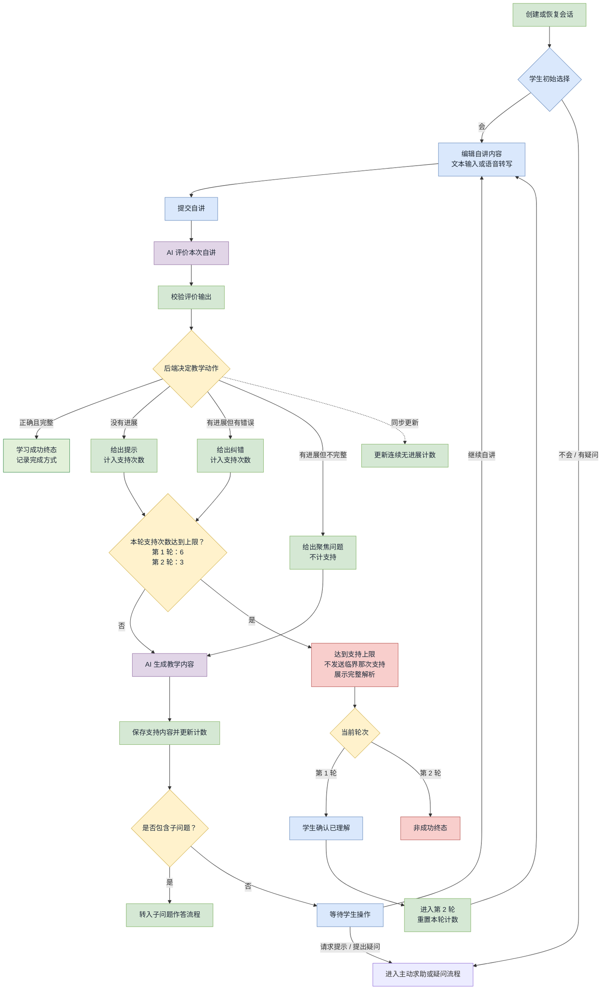
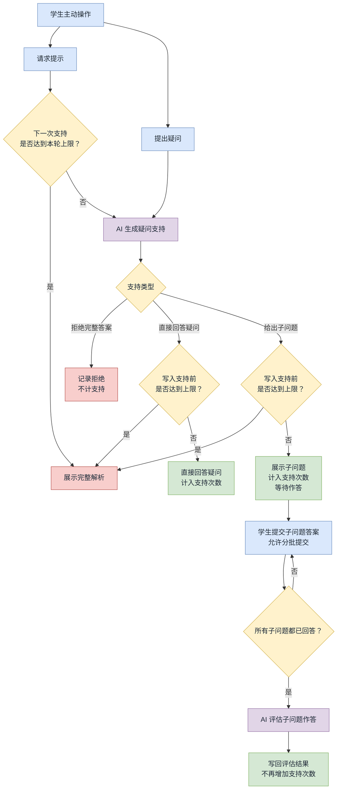

# 当前代码中的自讲流程

本文按当前工作区代码整理，只描述流程走向。流程判断以 `backend/app/rules/` 和 `backend/app/repositories/sessions.py` 为准，提示词只负责评价或生成内容。

## 主自讲流程

## 主动求助、疑问和子问题作答

## 暂停与恢复

暂停会保存当前阶段，恢复后回到该阶段。允许暂停的阶段：

- `WAIT_INITIAL_CHOICE`
- `CAPTURING_INPUT`
- `WAIT_STUDENT_ACTION`
- `SHOWING_FULL_SOLUTION`

`AI_EVALUATING`、`TRANSCRIBING` 和 `WAIT_GUIDED_ANSWERS` 不能直接暂停。

## 代码依据

- `backend/app/api/sessions.py`：学生操作入口和调用顺序。
- `backend/app/rules/teaching_decision.py`：评价结果到教学动作的确定性映射。
- `backend/app/rules/teaching_cycle.py`：支持上限和完成类型。
- `backend/app/rules/session_lifecycle.py`：状态、流程阶段和暂停规则。
- `backend/app/schemas/ai_evaluation.py`：评价输出字段及关系校验。
- `backend/app/schemas/teaching.py`：教学输入输出契约。
- `backend/app/schemas/support.py`：疑问支持和子问题作答契约。
- `backend/app/repositories/sessions.py`：计数、状态变更和数据落库。